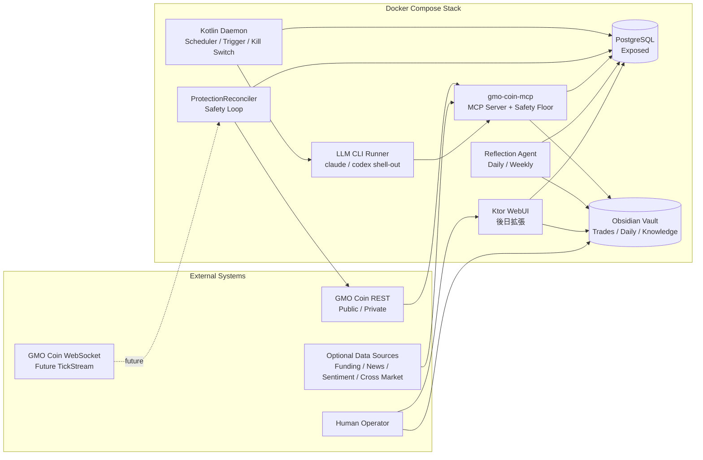
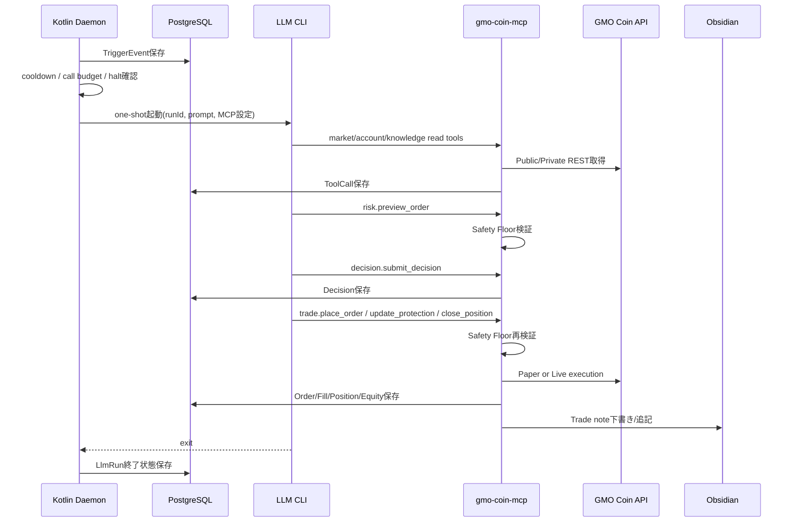

# Fukurou — 暗号資産デイトレAI bot 詳細設計書

- ファイル名: `crypto-trading-bot-design.md`
- 対象: BTC 一本 / 現物 / GMOコイン取引所側 / ペーパートレード開始
- 実装言語: Kotlin/JVM
- 実行形態: Docker(Linux) 常駐、24時間無人運転
- 設計日: 2026-07-01
- 改訂日: 2026-07-02（第3ラウンド根幹レビュー反映）
- ステータス: Step6（堅牢化 / config / Docker MCP 配線）まで実装済み。daemon scheduler / LlmInvoker 本実装 / live 実発注は未実装

> 本書はソフトウェア設計書であり、投資助言ではない。v1は「学習7 : 利益3」の実験基盤として、ペーパートレードを最初の本番環境として扱う。

---

## 1. 概要と設計思想（確定事項の要約＋あなたの設計方針）

### 1.1 確定事項の要約

[確定] 本システムは、Docker(Linux)上で24時間常駐するKotlin/JVM製の暗号資産デイトレAI botである。対象はBTC一本、現物、GMOコイン取引所側に限定し、当初は仮想10万円のペーパートレードから開始する。時間軸は「数分〜数時間」から、往復コストを踏まえた「数時間寄りの短期デイトレ」へ改訂する。合格ラインは3ヶ月ペーパーで `PF > 1.2` かつ `最大DD < 15%` とし、達成後に少額実弾へ移行する。

[確定] 判断思想は「コードは最低限の安全床のみを強制し、ツールは広く提供し、LLMに広い裁量を与える」。ただし、以下の安全床はMCPサーバー側で必ず強制し、override不可とする。

1. 1トレード最大損失2%
2. 全ポジションに損切り必須
3. ナンピン禁止
4. 総額ピークから最大DD -15%で全停止
5. 合計エクスポージャー上限（既定80%）
6. 残高超過・レート・コスト上限

[確定] デーモンは唯一のマクロ・スケジューラであり、発火ごとにCLIをワンショット起動する。保護・約定判定・HARD_HALT掃引は常駐 `ProtectionReconciler` が決定的に進め、LLM起動の合間にも止めない。LLMはCLIシェルアウトで実行し、`claude` / `codex` を `LlmInvoker` 抽象で差し替える。構造化は自由文パースではなく、MCPツール呼び出し、特に `decision.submit_decision` によって担保する。

[確定] ログと知識層は、PostgreSQL(Exposed)を機械的な真実、Obsidian Vaultを人間が読む知識として二本立てにする。振り返りエージェントが日次・週次で `Knowledge/` を書き、Dataviewで成績・override・失敗パターンを可視化する。

### 1.2 第3ラウンド根幹レビューによる確定事項の改訂

[確定事項の改訂: 2026-07-02] 判断層・daemon・評価設計について、以下を正本へ反映する。旧確定事項（confidence閾値、flat時15分定期発火、数分側スキャルプ寄りの時間軸）は本節の内容で上書きする。

- 全エントリーで setup タグと TradePlan を必須化し、振り返りエージェントが setup taxonomy を統合・改廃する。
- 新規エントリーだけを対象に、Proposer / Falsifier の二権非対称レビューを導入する。Falsifierは拒否権のみを持ち、退出・保護操作はブロックしない。
- `confidence >= 0.6` の発注ゲートを廃止し、コード計算のEVゲートへ置換する。confidenceは較正とデータ品質防衛の材料に限定する。
- エントリー時の TradePlan を position の plan-of-record として永続化し、以後の起動は維持・退出・理由必須の正式修正の3択に拘束する。正式修正は既定2回までとする。
- flat時はイベント発火 + 1時間ハートビートのみとし、15分定期発火を廃止する。保有中は密な保護・判断を維持する。
- maker-first、日次エントリー上限、想定値幅/往復コスト比、paper初期の実測較正により、安全床6「コスト上限」を実体化する。
- 経済イベントカレンダー、セッション時間帯、ATRパーセンタイル、要約特徴量中心の情報設計を導入する。
- buy&hold / no-trade ベンチマーク、kill基準、MAE/MFE、相場局面の偏り確認を評価設計に追加する。

### 1.3 本設計の方針

[設計提案] 本設計では「LLMに裁量を与える」と「LLMに安全床を破らせない」を両立するため、意思決定を次の3層に分ける。

| 層 | 責務 | override | 実装位置 |
|---|---|---:|---|
| 裁量層 | 方向、タイミング、サイズ、利確、買い増し判断、見送り理由 | 可能 | CLI LLM + MCP read/act tools |
| 運用ルール層 | confidence cap、発火閾値、ATR係数、クールダウン等 | 可能、理由必須 | daemon / MCP / config |
| 安全床層 | 2%損失、SL必須、ナンピン禁止、DD停止、エクスポージャー、EV<=0拒否、残高・レート・コスト上限 | 不可 | `gmo-coin-mcp` server-side |

[設計提案] v1は「1つの巨大なプロンプトで判断するbot」ではなく、「LLMが必要なデータをMCPで取りに行き、判断を `decision.submit_decision` と act系ツールで記録するbot」とする。これにより、自由文の取りこぼし、LLMの幻覚、CLI出力差異、モデル差し替え時のパース崩壊を避ける。

[設計提案] デイトレAIとして重要な追加要素は次の通り。

- 判断前のファクトチェックとセルフレビューを、1回のCLI起動内の必須手順にする。
- LLMの確信度をそのまま信じず、データ欠損・矛盾・スプレッド拡大・直近失敗などで上限を下げる「確信度キャップ」を設ける。
- 取引判断だけでなく「なぜ見送ったか」を高密度に保存し、日次・週次でKnowledgeへ反映する。
- ペーパー約定は単なる終値約定ではなく、板、スプレッド、手数料、スリッページ、all-or-noneの約定判定を近似し、本番乖離を減らす。FAK部分約定との差分は乖離メモに残す。
- 実弾前に、安全床・ペーパー約定・復旧・レート制限・CLI失敗時フォールバックをテストで固定する。

### 1.4 主要な仮定

[仮定] v1の売買方向は、現物BTCのため `BUY` によるロング構築と、`SELL` による保有BTCの縮小・全決済のみとする。ショート、レバレッジ、信用、暗号資産FXは扱わない。

[確定] GMOコインAPIの現物symbolは `BTC` であり、レバレッジの `BTC_JPY` とは別物として扱う。v1は現物BTCのみを対象にするため、内部表現も `TradingSymbol.BTC` を正本とし、将来の商品区分差分は `GmoSymbolMapper` で吸収する。起動時に `/public/v1/symbols` の取引ルールを取得し、現物で利用可能なsymbol、最小数量、刻み、maker/taker feeを検証する。

[確定] GMOコイン現物APIでは `executionType: STOP`（逆指値）を発注できる。OCO / IFD 注文は存在しない。v1は「実 STOP + virtual TP」を保護方式とし、損切りを優先して実 STOP を置き、利確は `ProtectionReconciler` が virtual trigger として管理する。STOP 約定時は virtual TP を破棄し、TP 到達時は STOP を cancel してから SELL する。現物の建玉はGMOの `openPositions` ではなくbot管理のposition ledgerを正本にする。少額実弾移行前に、現物STOPのトリガ挙動（成行執行・スリッページ・資金拘束・部分約定）を実機で検証する。

---

## 2. アーキテクチャ（コンポーネント図・データフロー）

### 2.1 コンポーネント全体図



### 2.2 主要コンポーネント

| コンポーネント | 実装モジュール | 責務 |
|---|---|---|
| Kotlin Daemon | `:fukurou` background worker / 将来 `:trading.daemon` | 常駐、定期発火、イベント発火、CLI起動、タイムアウト、キルスイッチ、復旧、通知 |
| ProtectionReconciler | `:trading.reconciler` + `:fukurou` background worker | LLM起動の合間の保護、paper約定判定、virtual TP、HARD_HALT掃引、DBロック取得 |
| Trigger Engine | `:trading.trigger` | flat時のイベント発火 + 1時間ハートビート、保有中の密発火、クールダウン制御 |
| LLM CLI Runner | `:trading.llm` / `:fukurou` caller | `claude` / `codex` をワンショット起動し、runId・MCP設定・初期プロンプトを渡す |
| MCP Server | `:mcp` | read系/act系ツール、risk preview、安全床強制、決定記録。業務ロジックは`:trading`へ委譲 |
| Safety Floor | `:trading.safety` + `:mcp` | 発注・保護更新・買い増し・overrideをサーバー側で検証し拒否ログを残す |
| Paper Simulator | `:trading.broker.paper` | 手数料、スプレッド、スリッページ、板歩き、all-or-none、保護ストップを近似 |
| Persistence | `:trading.persistence` | PostgreSQL/ExposedのRepository実装、audit、集計テーブル |
| Obsidian Writer | `:trading.knowledge` | frontmatter付きMarkdown生成、Dataview互換、MOC更新 |
| Reflection Agent | `:trading.reflection` | 日次・週次の振り返り、Knowledge更新、確信度較正、失敗パターン抽出 |
| Ktor WebUI | `:fukurou` | 後日: 状態確認、手動停止、成績、overrideレビュー、設定閲覧 |

### 2.3 データフロー

#### 2.3.1 市場データの流れ

1. `ProtectionReconciler` が `TickStream` 抽象から ticker/trades を短周期で受け取り、保護・約定判定に使う。
2. Step1.5時点の `TickStream` はREST polling（2〜5秒、ticker + trades）で開始し、live化前にWebSocketへ差し替え可能にする。
3. RESTで5分・1時間・日足のOHLCVを補完する。
4. `MarketDataSource` 実装が、ローソク足、板、約定、指標、マイクロストラクチャ要約を統一モデルへ変換する。
5. 必要なスナップショットのみPostgreSQLへ保存する。高頻度の板フル履歴はv1では保存せず、要約特徴量を保存する。
6. LLMは初期プロンプトで全データを受け取らず、MCP read系ツールで必要な粒度を取得する。

#### 2.3.2 発火から売買までの流れ



#### 2.3.3 CLI失敗時の守り

[確定] CLIの制限・失敗時は、コードのルールのみで建玉を守り、次発火で再開する。

[設計提案] CLIがタイムアウト、認証失敗、MCP未応答、tool call budget超過で終了した場合、daemonは以下だけを実行する。

1. DD停止条件を再評価する。
2. 保有中ならATRトレーリング床を更新する。床は緩めない。
3. ストップ到達なら即時クローズ相当のpaper execution、または実弾では成行/許容可能な決済注文を発行する。
4. 新規エントリー、買い増し、早期利確判断は行わない。
5. `llm_runs.status = FAILED` として、失敗理由をObsidian Dailyへ要約する。

---

## 3. パッケージ / モジュール構成

### 3.1 Gradleマルチモジュール構成

```text
fukurou/
├── settings.gradle.kts
├── build.gradle.kts
├── fukurou/
│   └── src/main/kotlin/me/matsumo/fukurou/
├── mcp/
│   └── src/main/kotlin/me/matsumo/fukurou/mcp/
├── trading/
│   └── src/main/kotlin/me/matsumo/fukurou/trading/
└── obsidian-vault-template/
    ├── 00_MOC/
    ├── Daily/
    ├── Instruments/
    ├── Knowledge/
    └── Trades/
```

### 3.2 モジュール依存方針

```text
:trading  取引domain、GMO adapter、broker、safety、persistence、reconcilerを持つ。MCP SDKやKtorには依存しない。
:mcp      MCP stdio server。tool schema、引数parse、`:trading` への委譲、構造化返却のみを持つ。業務ロジックを置かない。
:fukurou  Ktor backend。health/revision/openapiと、Step1.5以降のProtectionReconciler background worker実行体を持つ。
```

### 3.3 パッケージ命名

```text
me.matsumo.fukurou.trading.domain
me.matsumo.fukurou.trading.domain.port
me.matsumo.fukurou.trading.market
me.matsumo.fukurou.trading.exchange.gmo
me.matsumo.fukurou.trading.broker
me.matsumo.fukurou.trading.broker.paper
me.matsumo.fukurou.trading.safety
me.matsumo.fukurou.trading.persistence
me.matsumo.fukurou.trading.reconciler
me.matsumo.fukurou.trading.llm
me.matsumo.fukurou.trading.knowledge
me.matsumo.fukurou.trading.reflection
me.matsumo.fukurou.mcp.tool.market
me.matsumo.fukurou.mcp.tool.account
me.matsumo.fukurou.mcp.tool.trade
me.matsumo.fukurou.mcp.tool.risk
me.matsumo.fukurou.mcp.tool.knowledge
me.matsumo.fukurou.mcp.tool.decision
me.matsumo.fukurou.web
```

### 3.4 段階導入(MVP)方針

[設計提案] v1は全モジュール/全ツールを一度に作らず段階導入する。学習7:利益3のため、まず「ペーパーで1周回る」最小構成を最優先する。

- フェーズ1（ペーパーで1周回す最小構成）: `:trading` の `domain` / `market` / `exchange.gmo` / `broker` / `safety` / `persistence` / `reconciler`、`:mcp` の最小ツール（`market.*` / `account.*` / `risk.*` / `decision.submit_decision` / `trade.*`）、`:fukurou` のbackground worker。
- フェーズ2（学習の核）: `:trading.knowledge` / reflection runner / Dataview
- フェーズ3（拡張）: `:fukurou` WebUI / 追加データ源(B-1) / 通知(`Notifier`)

---

## 4. 主要インターフェースと型定義（抽象化ポイント）

### 4.1 ドメイン基本型

```kotlin
package me.matsumo.fukurou.trading.domain

import java.math.BigDecimal
import java.time.Duration
import java.time.Instant
import java.util.UUID
import kotlinx.collections.immutable.ImmutableList

/**
 * 取引対象を表す内部シンボル。
 * GMO API上のsymbol文字列は商品区分により差がありうるため、別途SymbolMapperで変換する。
 */
@JvmInline
value class TradingSymbol(
    val value: String,
)

/**
 * システム内の実行モード。
 * PAPERは合格判定前の唯一の既定モードであり、LIVEは少額実弾移行後のみ有効化する。
 */
enum class TradingMode {
    PAPER,
    LIVE,
}

/**
 * 取引時間足。
 * v1確定足は5分、1時間、日足である。
 */
enum class Timeframe(
    val apiValue: String,
    val duration: Duration,
) {
    FIVE_MINUTES("5min", Duration.ofMinutes(5)),
    ONE_HOUR("1hour", Duration.ofHours(1)),
    ONE_DAY("1day", Duration.ofDays(1)),
}

/**
 * LLMまたは安全床が扱う売買アクション。
 * 現物BTCのみのため、ショート新規は存在しない。
 */
enum class TradeAction {
    ENTER_LONG,
    ADD_LONG,
    HOLD,
    REDUCE,
    CLOSE,
    UPDATE_PROTECTION,
    NO_TRADE,
}

/**
 * 注文の売買方向。
 */
enum class OrderSide {
    BUY,
    SELL,
}

/**
 * 注文種別。
 * GMO現物APIで使うMARKET/LIMIT/STOPだけを表す。
 * STOP_LIMITやOCO/IFDはGMO現物APIの注文種別として扱わない。
 */
enum class OrderType {
    MARKET,
    LIMIT,
    STOP,
}

/**
 * 注文の執行数量条件。
 */
enum class TimeInForce {
    FAK,
    FAS,
    FOK,
    SOK,
}

/**
 * 発火イベントの種別。
 */
enum class TriggerKind {
    FLAT_HEARTBEAT_1H,
    PRICE_MOVE_5M,
    STRUCTURAL_BREAKOUT,
    POSITION_DENSE_CHECK,
    STARTUP_RECOVERY,
    MANUAL_OPERATOR,
    SAFETY_BACKSTOP,
}

/**
 * override可能な運用ルール。
 * Safety Floorそのものはここに含めない。
 */
enum class OverrideRuleKey {
    MIN_EXPECTED_VALUE_R,
    MIN_EXPECTED_MOVE_TO_COST_RATIO,
    MAX_DAILY_ENTRIES,
    PRICE_MOVE_TRIGGER_THRESHOLD,
    PYRAMID_MAX_ADDS,
    ATR_STOP_MULTIPLIER,
    TRAILING_ATR_MULTIPLIER,
    EARLY_TAKE_PROFIT_POLICY,
    COOLDOWN_DURATION,
    INDICATOR_PARAMETERS,
}
```

### 4.2 市場データ型

```kotlin
package me.matsumo.fukurou.trading.domain

import java.math.BigDecimal
import java.time.Instant
import kotlinx.collections.immutable.ImmutableList

/**
 * OHLCVローソク足。
 * timestampは足の開始時刻を表す。
 */
data class Candle(
    val symbol: TradingSymbol,
    val timeframe: Timeframe,
    val openTime: Instant,
    val open: BigDecimal,
    val high: BigDecimal,
    val low: BigDecimal,
    val close: BigDecimal,
    val volume: BigDecimal,
    val isFinal: Boolean,
)

/**
 * 最新気配と24時間統計のスナップショット。
 */
data class TickerSnapshot(
    val symbol: TradingSymbol,
    val timestamp: Instant,
    val bid: BigDecimal,
    val ask: BigDecimal,
    val last: BigDecimal,
    val high24h: BigDecimal,
    val low24h: BigDecimal,
    val volume24h: BigDecimal,
)

/**
 * 板の1価格帯。
 */
data class OrderBookLevel(
    val price: BigDecimal,
    val size: BigDecimal,
)

/**
 * 板スナップショット。
 * asksは昇順、bidsは降順で保持する。
 */
data class OrderBookSnapshot(
    val symbol: TradingSymbol,
    val timestamp: Instant,
    val asks: ImmutableList<OrderBookLevel>,
    val bids: ImmutableList<OrderBookLevel>,
)

/**
 * 歩み値の1約定。
 */
data class TradePrint(
    val symbol: TradingSymbol,
    val timestamp: Instant,
    val price: BigDecimal,
    val size: BigDecimal,
    val side: OrderSide,
    val exchangeExecutionId: String?,
)

/**
 * 取引ルール。
 * 起動時および定期的にGMO APIから取得し、注文丸めと手数料計算に使う。
 */
data class TradeRule(
    val symbol: TradingSymbol,
    val minOrderSize: BigDecimal,
    val maxOrderSize: BigDecimal,
    val sizeStep: BigDecimal,
    val tickSize: BigDecimal,
    val makerFeeRate: BigDecimal,
    val takerFeeRate: BigDecimal,
    val fetchedAt: Instant,
)

/**
 * 指標計算結果。
 * LLMに渡す値はこの型をもとに要約し、必要以上の生データを初期プロンプトへ入れない。
 */
data class IndicatorSnapshot(
    val symbol: TradingSymbol,
    val timeframe: Timeframe,
    val calculatedAt: Instant,
    val atr14: BigDecimal?,
    val ema20: BigDecimal?,
    val ema50: BigDecimal?,
    val rsi14: BigDecimal?,
    val macdLine: BigDecimal?,
    val macdSignal: BigDecimal?,
    val vwapSession: BigDecimal?,
    val volumeZScore: BigDecimal?,
)

/**
 * 板・歩み値から計算する短期需給特徴量。
 */
data class MicrostructureSnapshot(
    val symbol: TradingSymbol,
    val calculatedAt: Instant,
    val windowSeconds: Int,
    val spreadBps: BigDecimal,
    val orderBookImbalanceTop5: BigDecimal,
    val buySellVolumeDelta: BigDecimal,
    val tradeIntensityPerMinute: BigDecimal,
    val sweepDetected: Boolean,
    val stale: Boolean,
)
```

### 4.3 取引・ポジション型

```kotlin
package me.matsumo.fukurou.trading.domain

import java.math.BigDecimal
import java.time.Instant
import java.util.UUID

/**
 * 現在の保有ポジション。
 * 現物のため数量はBTC数量、評価額はJPYで保持する。
 */
data class PositionSnapshot(
    val positionId: UUID,
    val tradeGroupId: UUID,
    val symbol: TradingSymbol,
    val mode: TradingMode,
    val openedAt: Instant,
    val sizeBtc: BigDecimal,
    val averageEntryPriceJpy: BigDecimal,
    val currentPriceJpy: BigDecimal,
    val currentStopLossJpy: BigDecimal,
    val currentTakeProfitJpy: BigDecimal?,
    val unrealizedPnlJpy: BigDecimal,
    val unrealizedR: BigDecimal,
    val pyramidAddCount: Int,
    val highestPriceSinceEntryJpy: BigDecimal,
)

/**
 * 資産状態。
 * drawdownはequityPeakJpyからの下落率として負値で保持する。
 */
data class EquitySnapshot(
    val timestamp: Instant,
    val mode: TradingMode,
    val cashJpy: BigDecimal,
    val btcQuantity: BigDecimal,
    val btcMarkPriceJpy: BigDecimal,
    val totalEquityJpy: BigDecimal,
    val equityPeakJpy: BigDecimal,
    val drawdownRatio: BigDecimal,
)

/**
 * 注文要求。
 * LLMの希望を表すだけであり、発注前に必ずSafety Floorで検証する。
 */
data class OrderRequest(
    val requestId: UUID,
    val runId: UUID,
    val decisionId: UUID?,
    val symbol: TradingSymbol,
    val mode: TradingMode,
    val action: TradeAction,
    val side: OrderSide,
    val orderType: OrderType,
    val timeInForce: TimeInForce?,
    val sizeBtc: BigDecimal,
    val limitPriceJpy: BigDecimal?,
    val stopLossJpy: BigDecimal?,
    val takeProfitJpy: BigDecimal?,
    val clientOrderId: String,
    val reasonJa: String,
)

/**
 * 注文結果。
 */
data class OrderResult(
    val orderId: UUID,
    val exchangeOrderId: String?,
    val accepted: Boolean,
    val status: OrderStatus,
    val rejectionReasonJa: String?,
    val createdAt: Instant,
)

/**
 * 注文状態。
 */
enum class OrderStatus {
    REQUESTED,
    REJECTED_BY_SAFETY,
    REJECTED_BY_EXCHANGE,
    ACCEPTED,
    PARTIALLY_FILLED,
    FILLED,
    CANCELLED,
    EXPIRED,
}

/**
 * 約定結果。
 */
data class FillExecution(
    val fillId: UUID,
    val orderId: UUID,
    val exchangeExecutionId: String?,
    val symbol: TradingSymbol,
    val side: OrderSide,
    val filledAt: Instant,
    val priceJpy: BigDecimal,
    val sizeBtc: BigDecimal,
    val feeJpy: BigDecimal,
    val liquidity: LiquidityRole,
    val slippageBps: BigDecimal,
)

/**
 * 約定がMaker/Takerどちらとして扱われたか。
 */
enum class LiquidityRole {
    MAKER,
    TAKER,
    UNKNOWN,
}
```

### 4.4 LLM判断型

```kotlin
package me.matsumo.fukurou.trading.domain

import java.math.BigDecimal
import java.time.Instant
import java.util.UUID
import kotlinx.collections.immutable.ImmutableList

/**
 * LLMが最終的にMCPへ提出する判断。
 * 自由文パースではなく、decision.submit_decisionの入力スキーマとして受け取る。
 */
data class LlmDecision(
    val decisionId: UUID,
    val runId: UUID,
    val decidedAt: Instant,
    val action: TradeAction,
    val confidence: BigDecimal,
    val confidenceCalibrationJa: String,
    val estimatedWinProbability: BigDecimal?,
    val reasoningJa: String,
    val scenarioJa: String,
    val invalidationJa: String,
    val entryPlan: LlmEntryPlan?,
    val exitPlan: LlmExitPlan?,
    val riskPlan: LlmRiskPlan,
    val factCheck: LlmFactCheck,
    val selfReview: LlmSelfReview,
    val overrideRequests: ImmutableList<OverrideRequestDraft>,
    val toolEvidenceIds: ImmutableList<UUID>,
)

/**
 * LLMのエントリー計画。
 */
data class LlmEntryPlan(
    val preferredOrderType: OrderType,
    val limitPriceJpy: BigDecimal?,
    val sizeBtc: BigDecimal,
    val stopLossJpy: BigDecimal,
    val takeProfitJpy: BigDecimal?,
    val targetPriceJpy: BigDecimal,
    val expectedRMultiple: BigDecimal?,
    val setupTags: ImmutableList<String>,
)

/**
 * LLMの手仕舞い・継続計画。
 */
data class LlmExitPlan(
    val closeRatio: BigDecimal,
    val newStopLossJpy: BigDecimal?,
    val takeProfitJpy: BigDecimal?,
    val continueReasonJa: String?,
)

/**
 * LLMが認識したリスク計画。
 */
data class LlmRiskPlan(
    val maxLossJpy: BigDecimal,
    val riskRationaleJa: String,
    val atrValueJpy: BigDecimal?,
    val atrMultiplier: BigDecimal,
    val positionRiskR: BigDecimal,
    val expectedValueR: BigDecimal?,
    val roundTripCostR: BigDecimal?,
    val expectedMoveToCostRatio: BigDecimal?,
)

/**
 * エントリー後にpositionへ紐づく計画の正本。
 * 次回以降のLLMはこの計画を前提に、維持・退出・正式修正だけを選ぶ。
 * 正式修正は理由必須で、revisionCountはrisk.maxTradePlanRevisionsを超えられない。
 * 上限超過後は維持または退出だけを許可する。
 */
data class TradePlanSnapshot(
    val tradePlanId: UUID,
    val positionId: UUID,
    val thesisJa: String,
    val invalidationPredicates: ImmutableList<String>,
    val targetPriceJpy: BigDecimal,
    val timeStopAt: Instant?,
    val setupTags: ImmutableList<String>,
    val revisionCount: Int,
    val createdAt: Instant,
    val updatedAt: Instant,
)

/**
 * 判断直前のファクトチェック結果。
 */
data class LlmFactCheck(
    val tickerChecked: Boolean,
    val candlesChecked: Boolean,
    val orderBookChecked: Boolean,
    val positionsChecked: Boolean,
    val tradeRulesChecked: Boolean,
    val dataFreshnessIssue: Boolean,
    val contradictionsJa: ImmutableList<String>,
)

/**
 * LLM自身による反証レビュー。
 */
data class LlmSelfReview(
    val reasonsNotToTradeJa: ImmutableList<String>,
    val worstCaseJa: String,
    val confidenceCapApplied: Boolean,
    val confidenceCapReasonJa: String?,
)

/**
 * LLMが希望するoverride案。
 * Safety Floor関連のoverrideはスキーマ上受け付けない。
 */
data class OverrideRequestDraft(
    val ruleKey: OverrideRuleKey,
    val defaultValue: String,
    val requestedValue: String,
    val reasonJa: String,
)
```

### 4.5 安全床型

```kotlin
package me.matsumo.fukurou.trading.domain

import java.math.BigDecimal
import java.time.Instant
import java.util.UUID
import kotlinx.collections.immutable.ImmutableList

/**
 * override不可の安全床ルール。
 */
enum class SafetyFloorRule {
    MAX_RISK_PER_TRADE,
    STOP_LOSS_REQUIRED,
    NO_AVERAGING_DOWN,
    MAX_DRAWDOWN_HALT,
    MAX_TOTAL_EXPOSURE,
    BALANCE_RATE_AND_CALL_LIMIT,
    NON_POSITIVE_EXPECTED_VALUE,
    COST_DISCIPLINE_VIOLATION,
    FALSIFIER_APPROVAL_REQUIRED,
}

/**
 * 安全床検証の結果。
 */
sealed interface SafetyVerdict {
    /**
     * 安全床を通過した結果。
     */
    data class Accepted(
        val normalizedOrderRequest: OrderRequest,
        val checkedAt: Instant,
        val warningsJa: ImmutableList<String>,
    ) : SafetyVerdict

    /**
     * 安全床で拒否された結果。
     */
    data class Rejected(
        val rule: SafetyFloorRule,
        val messageJa: String,
        val checkedAt: Instant,
        val measuredValue: String,
        val limitValue: String,
        val violationId: UUID,
    ) : SafetyVerdict
}

/**
 * 安全床検証に必要な口座・ポジション・レート状態。
 */
data class SafetyContext(
    val equity: EquitySnapshot,
    val positions: ImmutableList<PositionSnapshot>,
    val openOrders: ImmutableList<OrderRequest>,
    val tradeRule: TradeRule,
    val callsInCurrentHour: Int,
    val privatePostRequestsInCurrentSecond: Int,
    val globalHalt: Boolean,
)
```

### 4.6 抽象インターフェース

```kotlin
package me.matsumo.fukurou.trading.domain.port

import me.matsumo.fukurou.trading.domain.Candle
import me.matsumo.fukurou.trading.domain.EquitySnapshot
import me.matsumo.fukurou.trading.domain.FillExecution
import me.matsumo.fukurou.trading.domain.IndicatorSnapshot
import me.matsumo.fukurou.trading.domain.LlmDecision
import me.matsumo.fukurou.trading.domain.MicrostructureSnapshot
import me.matsumo.fukurou.trading.domain.OrderBookSnapshot
import me.matsumo.fukurou.trading.domain.OrderRequest
import me.matsumo.fukurou.trading.domain.OrderResult
import me.matsumo.fukurou.trading.domain.PositionSnapshot
import me.matsumo.fukurou.trading.domain.SafetyContext
import me.matsumo.fukurou.trading.domain.SafetyVerdict
import me.matsumo.fukurou.trading.domain.TickerSnapshot
import me.matsumo.fukurou.trading.domain.Timeframe
import me.matsumo.fukurou.trading.domain.TradePrint
import me.matsumo.fukurou.trading.domain.TradeRule
import me.matsumo.fukurou.trading.domain.TradingSymbol
import java.time.Instant
import java.util.UUID
import kotlinx.collections.immutable.ImmutableList
import kotlinx.coroutines.flow.Flow

/**
 * 観測データを提供する抽象境界。
 * GMO以外の取引所、外部指標、ニュースなどはこのinterfaceを実装して追加する。
 */
interface MarketDataSource {
    suspend fun getTicker(
        symbol: TradingSymbol,
    ): Result<TickerSnapshot>

    suspend fun getCandles(
        symbol: TradingSymbol,
        timeframe: Timeframe,
        from: Instant?,
        to: Instant?,
        limit: Int,
    ): Result<ImmutableList<Candle>>

    suspend fun getOrderBook(
        symbol: TradingSymbol,
        depth: Int,
    ): Result<OrderBookSnapshot>

    suspend fun getRecentTrades(
        symbol: TradingSymbol,
        limit: Int,
        since: Instant?,
    ): Result<ImmutableList<TradePrint>>

    suspend fun getTradeRule(
        symbol: TradingSymbol,
    ): Result<TradeRule>

    suspend fun getMicrostructure(
        symbol: TradingSymbol,
        windowSeconds: Int,
    ): Result<MicrostructureSnapshot>

    fun streamMarketEvents(
        symbol: TradingSymbol,
    ): Flow<MarketEvent>
}

/**
 * 発火イベントを提供する抽象境界。
 * 定期発火、価格変動、保有中密チェック、外部ニュース発火などを統一する。
 */
interface TriggerSource {
    fun triggerEvents(): Flow<TriggerEvent>
}

/**
 * LLM CLIを起動する抽象境界。
 * claude/codexの差し替え、timeout、環境変数、MCP設定をここで吸収する。
 */
interface LlmInvoker {
    suspend fun invoke(
        request: LlmRunRequest,
    ): Result<LlmRunResult>
}

/**
 * 注文執行の抽象境界。
 * PaperとLiveの差を吸収し、MCP act系ツールから呼び出される。
 */
interface ExecutionGateway {
    suspend fun placeOrder(
        request: OrderRequest,
        safetyContext: SafetyContext,
    ): Result<OrderResult>

    suspend fun closePosition(
        command: ClosePositionCommand,
        safetyContext: SafetyContext,
    ): Result<OrderResult>

    suspend fun updateProtection(
        command: UpdateProtectionCommand,
        safetyContext: SafetyContext,
    ): Result<OrderResult>
}

/**
 * 安全床を検証する抽象境界。
 * 実装はgmo-coin-mcpサーバー側で必ず呼び出す。
 */
interface SafetyFloor {
    fun evaluateOrder(
        request: OrderRequest,
        context: SafetyContext,
    ): SafetyVerdict

    fun evaluateProtectionUpdate(
        command: UpdateProtectionCommand,
        context: SafetyContext,
    ): SafetyVerdict
}

/**
 * 取引関連の永続化境界。
 */
interface TradingRepository {
    suspend fun saveDecision(
        decision: LlmDecision,
    ): Result<Unit>

    suspend fun saveOrderResult(
        result: OrderResult,
    ): Result<Unit>

    suspend fun saveFill(
        fill: FillExecution,
    ): Result<Unit>

    suspend fun getOpenPositions(
        symbol: TradingSymbol,
    ): Result<ImmutableList<PositionSnapshot>>

    suspend fun getLatestEquity(): Result<EquitySnapshot>
}

/**
 * 知識検索・ノート生成の抽象境界。
 */
interface KnowledgeRepository {
    suspend fun searchSimilarSetups(
        query: SimilarSetupQuery,
    ): Result<ImmutableList<KnowledgeHit>>

    suspend fun getRecentLessons(
        symbol: TradingSymbol,
        limit: Int,
    ): Result<ImmutableList<KnowledgeHit>>

    suspend fun writeTradeNote(
        note: TradeNoteDraft,
    ): Result<KnowledgeWriteResult>

    suspend fun writeDailyNote(
        note: DailyNoteDraft,
    ): Result<KnowledgeWriteResult>
}

/**
 * 通知の抽象境界。
 * v1はログのみでもよいが、後でDiscord/Slack/メールへ差し替える。
 */
interface Notifier {
    suspend fun notify(
        event: NotificationEvent,
    ): Result<Unit>
}
```

### 4.7 補助型: Trigger / LLM Run / Knowledge

```kotlin
package me.matsumo.fukurou.trading.domain.port

import me.matsumo.fukurou.trading.domain.TriggerKind
import me.matsumo.fukurou.trading.domain.TradingSymbol
import java.time.Duration
import java.time.Instant
import java.util.UUID
import kotlinx.collections.immutable.ImmutableList

/**
 * 市場データストリームから流れるイベント。
 */
sealed interface MarketEvent {
    /**
     * 価格が更新されたイベント。
     */
    data class TickerUpdated(
        val symbol: TradingSymbol,
        val timestamp: Instant,
    ) : MarketEvent

    /**
     * 板が更新されたイベント。
     */
    data class OrderBookUpdated(
        val symbol: TradingSymbol,
        val timestamp: Instant,
    ) : MarketEvent
}

/**
 * daemonがLLM起動を検討する発火イベント。
 */
data class TriggerEvent(
    val triggerId: UUID,
    val kind: TriggerKind,
    val symbol: TradingSymbol,
    val occurredAt: Instant,
    val reasonJa: String,
    val cooldownBypass: Boolean,
)

/**
 * LLM CLI起動リクエスト。
 */
data class LlmRunRequest(
    val runId: UUID,
    val triggerEvent: TriggerEvent,
    val systemPromptPath: String,
    val dynamicPrompt: String,
    val workingDirectory: String,
    val timeout: Duration,
    val mcpServerName: String,
    val environment: Map<String, String>,
)

/**
 * LLM CLI実行結果。
 */
data class LlmRunResult(
    val runId: UUID,
    val exitCode: Int,
    val startedAt: Instant,
    val finishedAt: Instant,
    val timedOut: Boolean,
    val stdoutPath: String,
    val stderrPath: String,
    val decisionSubmitted: Boolean,
)

/**
 * ポジションを閉じる指示。
 */
data class ClosePositionCommand(
    val commandId: UUID,
    val runId: UUID,
    val symbol: TradingSymbol,
    val closeRatio: java.math.BigDecimal,
    val reasonJa: String,
)

/**
 * ポジション保護を更新する指示。
 * STOPは締め方向のみ、TPはvirtual triggerとして変更・削除できる。
 */
data class UpdateProtectionCommand(
    val commandId: UUID,
    val runId: UUID,
    val positionId: UUID,
    val requestedStopLossJpy: java.math.BigDecimal?,
    val requestedTakeProfitJpy: java.math.BigDecimal?,
    val reasonJa: String,
)

/**
 * 類似局面検索クエリ。
 */
data class SimilarSetupQuery(
    val symbol: TradingSymbol,
    val regimeJa: String,
    val signalSummaryJa: String,
    val limit: Int,
)

/**
 * Knowledge検索結果。
 */
data class KnowledgeHit(
    val notePath: String,
    val title: String,
    val summaryJa: String,
    val score: java.math.BigDecimal,
)

/**
 * Knowledge書き込み結果。
 */
data class KnowledgeWriteResult(
    val notePath: String,
    val created: Boolean,
    val updatedAt: Instant,
)

/**
 * 通知イベント。
 */
data class NotificationEvent(
    val level: NotificationLevel,
    val titleJa: String,
    val bodyJa: String,
    val occurredAt: Instant,
)

/**
 * 通知レベル。
 */
enum class NotificationLevel {
    INFO,
    WARNING,
    CRITICAL,
}
```

### 4.8 将来WebUI向けのImmutable型方針

[確定] Composableから参照する型や公開する `List`/`Map` は `kotlinx.collections.immutable` のImmutable型、`@Stable`/`@Immutable` を付与する。

[設計提案] domain型をそのままUIへ露出せず、`:fukurou` WebUI または将来のCompose UIでViewStateへ変換する。

```kotlin
package me.matsumo.fukurou.web.model

import androidx.compose.runtime.Immutable
import java.math.BigDecimal
import java.time.Instant
import kotlinx.collections.immutable.ImmutableList

/**
 * 将来のWeb/Compose UIに公開するポジション表示状態。
 */
@Immutable
data class PositionViewState(
    val symbol: String,
    val sizeBtc: BigDecimal,
    val entryPriceJpy: BigDecimal,
    val markPriceJpy: BigDecimal,
    val stopLossJpy: BigDecimal,
    val unrealizedPnlJpy: BigDecimal,
    val tags: ImmutableList<String>,
    val updatedAt: Instant,
)
```

---

## 5. データ源層（`MarketDataSource` / `TriggerSource` と拡張候補=B-1）

### 5.1 v1必須データ源

[確定] v1データ源は、価格・ローソク足＋出来高、テクニカル指標、板・約定フローである。時間足は5分、1時間、日足のマルチタイムフレームとする。

| データ | 取得元 | interface | 用途 | LLMへ渡す形 |
|---|---|---|---|---|
| Ticker | GMO Public REST / 将来TickStream WS | `MarketDataSource.getTicker` | 現在価格、bid/ask、スプレッド | 最新値＋鮮度 |
| KLine/OHLCV | GMO Public REST | `getCandles` | MTF環境認識、ATR、移動平均 | 指標要約＋必要時ローソク |
| OrderBook | GMO Public REST / 将来TickStream WS | `getOrderBook` | スプレッド、板厚、需給偏り | top N＋要約特徴量 |
| Trades | GMO Public REST / 将来TickStream WS | `getRecentTrades` | 歩み値、出来高デルタ、スイープ検出 | 直近要約＋異常フラグ |
| Trade Rules | GMO Public REST | `getTradeRule` | 最小数量、tick、手数料、丸め | 発注前必須 |
| Account Assets | GMO Private REST / Paper ledger | account tool | 残高、BTC保有量 | 発注前必須 |
| Open Orders / Positions | GMO Private REST / bot-managed position ledger / Paper ledger | account tool | 建玉、保護ストップ、注文整合性 | 判断履歴・安全床 |
| Economic Calendar | 静的イベントカレンダー | `EventCalendarSource` | FOMC / CPI 等の前後N分エントリー禁止 | deterministicな禁止理由 |

### 5.2 GMO APIマッピング方針

[設計提案] GMO APIの具体エンドポイントは `:trading.exchange.gmo` に閉じ込める。MCPツール・domain層は `TradingSymbol` と統一モデルのみを扱う。

| domain操作 | GMO API候補 | 備考 |
|---|---|---|
| ticker | `GET /public/v1/ticker` | symbol変換を通す。`TickStream` の初期実装はREST polling |
| orderbook | `GET /public/v1/orderbooks` | snapshotとして扱い、鮮度を記録 |
| trades | `GET /public/v1/trades` | 直近約定と出来高デルタに使用。`TickStream` の初期実装はREST polling |
| candles | `GET /public/v1/klines` | 5min/1hour/1dayを取得。`date` は1min〜1hourが `YYYYMMDD`、4hour以上が `YYYY` |
| trade rules | `GET /public/v1/symbols` | 最小数量・tick・maker/taker fee |
| balances | `GET /private/v1/account/assets` | Paperではledgerから返す |
| active orders | `GET /private/v1/activeOrders` | 起動時復旧・整合性確認 |
| place order | `POST /private/v1/order` | `executionType` は `MARKET` / `LIMIT` / `STOP` のみ。live移行後のみ。必ずSafety Floor通過後 |
| change order | `POST /private/v1/changeOrder` | 現物STOP/指値変更は `orderId` + `price` で扱う。`losscutPrice` はレバレッジ専用として使わない |
| cancel order | `POST /private/v1/cancelOrder` | 復旧・整理に使用 |

[確定] GMO現物では `executionType: STOP` を使える。OCO / IFD は提供されていない。保護方式は実STOPを損切り用に優先し、TPはDB上のvirtual triggerとして `ProtectionReconciler` が管理する。現物ではSTOPとLIMITを別建てで同時フルサイズ売りすると残高二重拘束で拒否されうるため、dual resting exitは採用しない。実弾前に現物STOPの実挙動を検証する。

[確定] ローソク足の取得では、5分足・1時間足は当日と前日を連結して末尾N本を作れる。日足は `date=YYYY` の年単位取得であり、年初付近だけ前年も追加取得する。

[確定] 現物liveの建玉はGMOの `openPositions` ではなく、bot管理のposition ledgerを正本にする。`openPositions` / `account/margin` はレバレッジ向けであり、v1の現物建玉判定には使わない。

```kotlin
/**
 * GMO APIのsymbol文字列を内部シンボルへ変換する境界。
 */
interface GmoSymbolMapper {
    fun toPublicApiSymbol(
        symbol: TradingSymbol,
    ): String

    fun toPrivateApiSymbol(
        symbol: TradingSymbol,
    ): String

    fun fromApiSymbol(
        apiSymbol: String,
    ): TradingSymbol
}
```

### 5.3 先行/遅行データ源の拡張候補

[設計提案] デイトレAIでは、価格・指標だけだと「すでに起きたこと」の説明に寄りやすい。v1ではGMOデータのみで始めるが、追加候補は先行性、実装難度、ノイズを基準に段階導入する。

| 優先 | データ源 | 先行/遅行 | 取得方法 | interface mapping | 使い道 | 実装難度 | 根拠/注意 |
|---:|---|---|---|---|---|---|---|
| P1 | 他市場BTC価格・出来高 | やや先行 | Binance/bitFlyer/Coinbase等のPublic API | `MarketDataSource` + `TriggerSource` | GMO価格乖離、急変検知、流動性把握 | 中 | GMO単独の板が薄い時間帯の補助 |
| P1 | 無期限先物の funding rate / open interest | 先行寄り | 主要デリバティブ取引所API | `MarketDataSource` | 過熱感、ロング/ショート偏り | 中 | 現物でもBTC短期需給に影響しやすい |
| P1 | 板異常検知 | 先行 | GMO WS orderbook/trades | `TriggerSource` | 厚い板の消失、スイープ、スプレッド急拡大 | 低 | v1データ内で実装可能 |
| P2 | ニュース/障害/規制ヘッドライン | 先行だがノイズ大 | RSS/API/手動キュレーション | `TriggerSource` + `KnowledgeRepository` | 急落/急騰の背景、取引回避 | 中 | 自動売買の根拠に単独使用しない |
| P2 | Fear & Greed / SNS sentiment | 遅行〜同時 | 公開API/有料API | `MarketDataSource` | 日足の地合い補助 | 低〜中 | 数分足の直接根拠にしない |
| P1 | 経済イベントカレンダー | 先行イベント | 静的日程ファイル/手動更新 | `EventCalendarSource` + `SafetyFloor` | FOMC/CPI等の前後N分は新規エントリー禁止 | 低 | ニュースAPIとは別物。phase1で導入可能 |
| P2 | ETF/マクロニュース | 先行だがノイズ大 | RSS/API/手動キュレーション | `TriggerSource` + `KnowledgeRepository` | 急落/急騰の背景、取引回避 | 中 | 自動売買の根拠に単独使用しない |
| P3 | オンチェーン指標 | 遅行〜中期 | Glassnode/CryptoQuant等 | `MarketDataSource` | 日足以上の環境認識 | 高/有料 | 数分デイトレでは優先度低 |
| P3 | Stablecoinフロー | 先行の可能性 | 有料API | `MarketDataSource` | リスクオン/オフ | 高 | 誤検知・APIコストに注意 |

### 5.4 データ鮮度と信頼度

[設計提案] 全データに `fetchedAt` / `sourceTimestamp` / `stalenessMs` / `source` を持たせる。LLMが古いデータを新しいと誤認しないよう、MCP read toolのレスポンスには必ず鮮度を含める。

| データ | stale判定既定 | stale時の扱い |
|---|---:|---|
| ticker | 5秒超 | 新規注文禁止、保有中はSTOP監視のみ継続 |
| orderbook | 3秒超 | 成行/指値判断の信頼度を下げる |
| trades | 10秒超 | microstructure未確認扱い |
| 5分足 | 次足開始から90秒超未更新 | 指標計算に警告 |
| 1時間足 | 次足開始から5分超未更新 | 上位足判断に警告 |
| 日足 | JST更新時刻を考慮 | 地合い判断のみ |
| account/position | 10秒超 | act系ツール前に再取得必須 |

### 5.5 指標計算

[確定] 損切りはATRベース、既定ATR期間14、係数 `k = 2.0`。

[設計提案] 指標はLLMが自由に使えるが、v1でMCPが計算提供する最小セットは以下とする。

| 指標 | 足 | 用途 |
|---|---|---|
| ATR(14) | 5m/1h/1d | SL、トレーリング、ボラ判定 |
| EMA(20/50) | 5m/1h/1d | トレンド方向、押し目/戻り |
| RSI(14) | 5m/1h | 過熱/反発候補。ただし単独売買禁止の原則をsystemへ記載 |
| MACD | 1h/5m | モメンタム確認 |
| VWAP | セッション/日中 | 短期平均回帰・乖離 |
| Volume z-score | 5m | 出来高急増の検出 |
| Spread bps | tick | 執行コスト判定 |
| Order book imbalance | tick | 短期需給確認 |
| ATR percentile | 5m/1h/1d | 現在ボラの相対化、低ボラ時のコスト比警告 |

---

## 6. 発火エンジンと呼び出しモデル（A-7）

### 6.1 発火条件

[確定事項の改訂: 2026-07-02] 発火はハイブリッドだが、flat時の15分定期発火は廃止する。flat時はイベント `±1%/5分` などの構造発火 + 1時間ハートビートのみ、保有中は密、クールダウン既定5分とする。

[設計提案] v1の具体条件は次の通り。

| 発火 | 条件 | cooldown | 備考 |
|---|---|---:|---|
| flatハートビート | ポジションなしで1時間ごと、JST基準で毎時00分 | 適用 | 生存確認・地合い更新。新規判断は控えめに扱う |
| 価格急変 | 5分前midから `abs(change) >= 1.0%` | 適用。ただし保有中STOP接近は bypass | 急変時の確認 |
| 構造イベント | 1時間足の新高値/新安値、主要レンジ抜けなど | 適用 | 静かなトレンド取り逃しの緩和。daemon設計時に条件を追加 |
| 保有中密 | ポジションありなら1分ごと | 5分ではなく1分。LLM呼び出しは条件付き | STOP/TP近接、1R到達、ATR床更新 |
| 起動時復旧 | プロセス起動直後 | bypass | DB/取引所/ペーパー台帳の整合性確認 |
| 安全バックストップ | DD閾値、STOP到達、データ不整合 | bypass | LLMを呼ばずコードで守る場合あり |
| 手動 | WebUI/CLIで明示発火 | bypass可能 | 理由必須 |

### 6.2 daemonの責務

[確定] daemonが唯一のマクロ・スケジューラである。`schedule_next_check` のようなLLM自己スケジュールは採用しない。

[確定] daemonの定義は「マクロ発火スケジューラ + 常駐ProtectionReconciler」である。前者はLLMをいつ起動するかを決め、後者はLLM起動中かどうかに依存せず、保護STOP、virtual TP、paper約定、HARD_HALT掃引を短い周期で決定的に進める。

[設計提案] daemonは次の状態機械で動く。

```text
BOOT
  -> RECOVER_STATE
  -> RUNNING
RUNNING
  -> RECEIVE_TRIGGER
  -> CHECK_COOLDOWN_AND_BUDGET
  -> APPLY_CODE_BACKSTOP
  -> INVOKE_LLM_ONESHOT
  -> WAIT_CLI_EXIT_OR_TIMEOUT
  -> RECONCILE_AFTER_RUN
  -> RUNNING
RUNNING
  -> HALTED_BY_DRAWDOWN
  -> ONLY_CLOSE_ALLOWED
```

### 6.3 発火処理の擬似コード

```kotlin
suspend fun handleTrigger(
    triggerEvent: TriggerEvent,
): Result<Unit> = runCatching {
    repository.saveTrigger(triggerEvent).getOrThrow()

    val runtimeState = runtimeStateLoader.load().getOrThrow()
    val globalHaltEnabled = runtimeState.equity.drawdownRatio <= config.risk.maxDrawdownRatio
    if (globalHaltEnabled) {
        killSwitch.haltAll("最大DDに到達したため全停止", triggerEvent).getOrThrow()
        return@runCatching
    }

    val shouldSkipByCooldown = cooldownService.shouldSkip(triggerEvent).getOrThrow()
    if (shouldSkipByCooldown && !triggerEvent.cooldownBypass) {
        repository.saveSkippedTrigger(triggerEvent, "cooldown中").getOrThrow()
        return@runCatching
    }

    deterministicBackstop.applyTrailingAndStop(runtimeState).getOrThrow()

    val llmBudgetAvailable = llmCallBudget.tryAcquire(triggerEvent.occurredAt)
    if (!llmBudgetAvailable) {
        repository.saveSkippedTrigger(triggerEvent, "LLM呼び出し上限").getOrThrow()
        return@runCatching
    }

    val runId = UUID.randomUUID()
    val prompt = promptFactory.buildDynamicPrompt(runId, triggerEvent, runtimeState)
    val llmResult = llmInvoker.invoke(
        LlmRunRequest(
            runId = runId,
            triggerEvent = triggerEvent,
            systemPromptPath = config.llm.systemPromptPath,
            dynamicPrompt = prompt,
            workingDirectory = config.llm.workingDirectory,
            timeout = config.llm.perRunTimeout,
            mcpServerName = config.mcp.serverName,
            environment = runEnvironmentFactory.create(runId),
        ),
    ).getOrThrow()

    postRunReconciler.reconcile(llmResult).getOrThrow()
}
```

[確定] daemonはCLI起動時に `FUKUROU_INVOCATION_ID`（= `decisionRunId`）を環境変数へ注入する。MCPは全tool callへこのIDを自動付与し、`decision_run_id` / `tool_call_id` / `client_request_id` / `llm_provider` / `prompt_hash` / `system_prompt_version` / `market_snapshot_id` をauditとして保存する。

[確定事項の改訂: 2026-07-02] flat時15分定期発火（96起動/日）は廃止し、1時間ハートビート（24起動/日）+ イベント発火へ変更する。Step1スパイクでは、1起動あたりの実測token・所要時間・tool call数を記録し、daemonのcadence設計とサブスク枠見積もりの入力にする。起動あたりエントリー率は行動バイアスの健全性メトリクスとして監視する。

### 6.4 1起動内で許可すること/禁止すること

| 区分 | 許可 | 禁止 |
|---|---|---|
| データ取得 | MCPでticker/candles/orderbook/trades/account/knowledge取得 | 外部サイトを勝手にブラウズして根拠不明データで売買 |
| 数秒待機 | 1起動内で最大2回、各3〜5秒程度の再取得 | 分単位sleep、自己再スケジュール |
| ツール呼び出し | 既定最大30回/起動 | 無制限ループ |
| 判断提出 | `decision.submit_decision` を1回だけ | 複数の矛盾する最終判断 |
| 発注 | `risk.preview_order` 後にact系ツール | previewなしのact系ツール |

### 6.5 呼び出し回数・実行時間

[設計提案] 既定値:

- LLM最大呼び出し回数: 12回/時
- LLM通常目標: flat時は1時間ハートビート + イベント発火、保有中は状態に応じて15分以下
- 1起動の最大実行時間: 180秒
- 1起動のMCP tool call上限: 30回
- act系tool call上限: 3回/起動
- 1起動内のsleep合計: 最大10秒

上限到達時は新規判断を行わず、daemonのバックストップのみで守る。

---

## 7. `LlmInvoker`（CLI抽象）とプロンプト設計（B-2, B-5）

### 7.1 CLI抽象の設計

[確定] ランタイム判断LLMはCLIシェルアウト。`claude` / `codex` 両対応。Koog・従量APIは不採用。

[設計提案] CLIの標準出力を売買判断の一次データにしない。LLMはMCPツール `decision.submit_decision` を必ず呼び、MCPがDBへ保存する。daemonはCLI終了後、DB上の `decisions.run_id` を確認する。

```kotlin
package me.matsumo.fukurou.trading.llm

import me.matsumo.fukurou.trading.domain.port.LlmInvoker
import me.matsumo.fukurou.trading.domain.port.LlmRunRequest
import me.matsumo.fukurou.trading.domain.port.LlmRunResult

/**
 * CLIコマンドテンプレートを使うLLM起動実装。
 * claude/codex固有の引数はconfigへ逃がし、このclassはProcessBuilderの境界に集中する。
 */
class ShellLlmInvoker(
    private val commandRenderer: LlmCommandRenderer,
    private val processRunner: ProcessRunner,
) : LlmInvoker {
    override suspend fun invoke(
        request: LlmRunRequest,
    ): Result<LlmRunResult> = runCatching {
        val command = commandRenderer.render(request).getOrThrow()
        processRunner.run(command, request).getOrThrow()
    }
}

/**
 * LLM CLIのコマンドラインを生成する境界。
 */
interface LlmCommandRenderer {
    fun render(
        request: LlmRunRequest,
    ): Result<List<String>>
}
```

設定例:

```yaml
llm:
  provider: "codex" # codex | claude
  perRunTimeoutSeconds: 180
  workingDirectory: "/var/lib/fukurou/llm-workdir"
  systemPromptPath: "/etc/fukurou/prompts/trading-system.md"
  commandTemplates:
    codex:
      argv:
        - "codex"
        - "{prompt}"
    claude:
      argv:
        - "claude"
        - "{prompt}"
  maxCallsPerHour: 12
  maxToolCallsPerRun: 30
  maxActToolCallsPerRun: 3
```

[設計提案] CLIオプションはバージョンで変わりうるため、`argv` はコードに固定しない。`codex "..."` / `claude "..."` のような最小形を既定にし、非対話・JSONストリーム等のオプションはconfigで差し替える。

### 7.2 初期プロンプトの分割

[確定] system固定部 + 動的な相場データのみ都度。プロンプトキャッシュを活用する。

[設計提案] プロンプトは以下の3層に分ける。

| 部分 | 内容 | 更新頻度 | サイズ目標 |
|---|---|---:|---:|
| System固定部 | 役割、禁止事項、安全床、思考手順、MCP使用手順、出力スキーマ | 低 | 4,000〜6,000 tokens |
| Runtime固定部 | runId、mode、対象symbol、現在のconfig hash、MCP server名 | 起動ごと | 500 tokens |
| 動的部 | 発火理由、直近ポジション、直近トレード、override履歴、最低限の相場要約 | 起動ごと | 2,000〜4,000 tokens |

### 7.3 system固定部プロンプト案

```markdown
あなたはBTC現物デイトレAIです。目的は学習7・利益3です。過度に攻めず、根拠が薄いときは見送ります。

絶対制約:
- 対象はBTC現物のみ。ショート、レバレッジ、ナンピンは禁止。
- 全ポジションには損切りが必須です。
- 1トレード最大損失は口座評価額の2%以内です。
- 最大DD -15% 到達時は全停止です。
- 安全床はMCPサーバーが強制します。あなたは破ろうとしてはいけません。

判断原則:
- 上位足に逆らわない。ただし上位足が曖昧なら短期足だけで無理に入らない。
- 損小利大を優先する。期待Rが悪い取引は見送る。
- 5分足はタイミング、1時間足は方向、日足は地合いとして統合する。
- 板と歩み値はエントリー直前の執行品質確認に使う。
- データが古い、矛盾している、スプレッドが広い、急変直後で約定品質が悪い場合は確信度を下げる。
- NO_TRADE が最も多い正解です。取引回数を増やすこと自体を目的にしてはいけません。
- エントリーは推定勝率p・目標価格・STOP・往復コストからコードが計算するEVゲートを通る必要があります。confidenceは発注ゲートではなく、較正とデータ品質防衛の材料です。

必須手順:
1. market/account/risk/knowledge の必要なread toolを使ってファクトを確認する。
2. エントリーまたは買い増し前に risk.preview_order を呼ぶ。
3. 反証として「取引しない理由」を最低3つ検討する。
4. decision.submit_decision を正確に1回呼ぶ。
5. 新規エントリーが必要な場合はFalsifier判定をDBに記録してから trade.place_order を呼ぶ。close_position / update_protection はFalsifierでブロックしない。

禁止:
- schedule_next_check のような自己スケジュールを行わない。
- 自由文だけで最終判断を返さない。
- 見ていない数値を見たふりしない。
- 損失中の買い増しを提案しない。
- STOPを緩めない。

判断理由は日本語で、Obsidianにそのまま読める密度で書くこと。
```

### 7.4 動的プロンプトのフォーマット

```yaml
run:
  runId: "8f00a9c2-9d85-4f20-9d88-7119a955ef01"
  mode: "PAPER"
  symbol: "BTC"
  trigger:
    kind: "PRICE_MOVE_5M"
    occurredAt: "2026-07-01T12:45:00+09:00"
    reasonJa: "5分で+1.12%上昇。保有なし。"
  limits:
    maxRuntimeSeconds: 180
    maxToolCalls: 30
    maxActToolCalls: 3
    maxSleepsTotalSeconds: 10

accountSummary:
  equityJpy: 100000
  equityPeakJpy: 102300
  drawdownRatio: -0.0225
  cashJpy: 100000
  btcQuantity: 0

positions:
  open: []

recentTrades:
  - tradeId: "paper-20260630-001"
    action: "NO_TRADE"
    reasonJa: "1時間足が横ばいで、5分足のブレイクが出来高不足だった"
  - tradeId: "paper-20260629-004"
    action: "CLOSE"
    pnlJpy: -850
    lessonJa: "急変直後の成行でスリッページが拡大。板確認を強化する"

overridesRecent:
  - ruleKey: "MIN_EXPECTED_VALUE_R"
    defaultValue: "0.0"
    requestedValue: "-0.05"
    applied: false
    reasonJa: "安全床に触れるため拒否"

initialMarketHint:
  ticker:
    lastJpy: 10000000
    spreadBps: 1.5
    freshnessMs: 1200
  mtfSummary:
    d1: "上昇基調だが前日高値付近"
    h1: "EMA20上、出来高増"
    m5: "急伸後の押し待ち"

instruction:
  ja: "必要なデータはMCPで取りに行き、最後に decision.submit_decision を1回呼んでください。"
```

### 7.5 意思決定フレーム

[設計提案] LLMには具体戦略を固定しないが、判断フレームだけは固定する。

```text
ECSR-R Framework

1. Environment（環境認識）
   - 日足: 地合い、重要価格帯、ボラ、前日高値安値
   - 1時間足: トレンド方向、レンジ/ブレイク、EMA/VWAP/出来高
   - 5分足: エントリータイミング、押し/ブレイク/失速

2. Confluence（根拠の突き合わせ）
   - 価格アクション、出来高、ATR、板、歩み値、直近失敗/成功を比較
   - 根拠が同じ情報の言い換えだけになっていないか確認

3. Scenario（シナリオ）
   - 上方向シナリオ、否定条件、横ばい/下方向の代替シナリオ
   - どの価格を超えた/割ったら判断が間違いか明文化

4. Risk/Reward（リスク設定）
   - ATRベースSL、想定TP、期待R、スプレッド/スリッページ込み
   - 2%枠内のサイズ。STOPなしは不可

5. Review（反証）
   - 取引しない理由を3つ以上
   - confidence capを適用すべきか
   - 似た過去失敗がKnowledgeにないか
```

### 7.6 LLM出力スキーマ

[確定] LLM出力は full: action / 確信度 / 理由 / SL / TP。

[設計提案] 実体は `decision.submit_decision` の入力JSONとする。

```json
{
  "runId": "uuid",
  "action": "ENTER_LONG | ADD_LONG | HOLD | REDUCE | CLOSE | UPDATE_PROTECTION | NO_TRADE",
  "confidence": "0.00-1.00 decimal string",
  "estimatedWinProbability": "0.00-1.00 decimal string or null",
  "confidenceCalibrationJa": "確信度をこの値にした理由。過信抑制・cap適用も書く。",
  "reasoningJa": "最終判断の日本語理由。Obsidianにそのまま記録される。",
  "scenarioJa": "上方向/横ばい/下方向の主シナリオと代替シナリオ。",
  "invalidationJa": "この判断が間違いになる条件。価格・時間・出来高など。",
  "entryPlan": {
    "preferredOrderType": "MARKET | LIMIT | STOP",
    "limitPriceJpy": "decimal string or null",
    "sizeBtc": "decimal string",
    "stopLossJpy": "decimal string",
    "targetPriceJpy": "decimal string",
    "takeProfitJpy": "decimal string or null",
    "expectedRMultiple": "decimal string or null",
    "setupTags": ["trend-follow", "pullback"]
  },
  "tradePlan": {
    "thesisJa": "このポジションを持つ理由。",
    "invalidationPredicates": ["price < 9700000", "1h close below EMA20"],
    "timeStopAt": "ISO-8601 datetime or null"
  },
  "exitPlan": {
    "closeRatio": "0.00-1.00 decimal string",
    "newStopLossJpy": "decimal string or null",
    "takeProfitJpy": "decimal string or null",
    "continueReasonJa": "保有継続理由 or null"
  },
  "riskPlan": {
    "maxLossJpy": "decimal string",
    "riskRationaleJa": "2%枠、ATR、SL距離、サイズの説明。",
    "atrValueJpy": "decimal string or null",
    "atrMultiplier": "decimal string",
    "positionRiskR": "decimal string",
    "expectedValueR": "decimal string or null",
    "roundTripCostR": "decimal string or null",
    "expectedMoveToCostRatio": "decimal string or null"
  },
  "factCheck": {
    "tickerChecked": true,
    "candlesChecked": true,
    "orderBookChecked": true,
    "positionsChecked": true,
    "tradeRulesChecked": true,
    "dataFreshnessIssue": false,
    "contradictionsJa": ["矛盾点。なければ空配列。"]
  },
  "selfReview": {
    "reasonsNotToTradeJa": ["理由1", "理由2", "理由3"],
    "worstCaseJa": "想定される最悪ケース。",
    "confidenceCapApplied": false,
    "confidenceCapReasonJa": null
  },
  "overrideRequests": [
    {
      "ruleKey": "MIN_EXPECTED_VALUE_R",
      "defaultValue": "0.0",
      "requestedValue": "-0.05",
      "reasonJa": "override理由"
    }
  ],
  "toolEvidenceIds": ["tool-call-uuid-1", "tool-call-uuid-2"]
}
```

### 7.7 1起動のトークン予算

[設計提案] CLIサブスク利用でも、長文コンテキストは速度・制限・失敗率に効くため予算を置く。

| 項目 | 目標 |
|---|---:|
| System固定部 | 4k〜6k tokens |
| 動的初期プロンプト | 2k〜4k tokens |
| MCP tool定義 | CLI/MCP側に委ねるが、ツール数はv1で30未満 |
| tool結果合計 | 20k tokens目安。ローソク足生データは必要時のみ |
| decision.submit_decision | 1k〜2k tokens |
| 1起動合計 | 30k tokens以下を目安 |

LLMには `market.build_context_bundle` で要約を取得させ、必要な場合だけ `market.get_candles` のrawを取得させる。

---

## 8. 判断の品質保証・ファクトチェック・レビュー機構（B-3）

### 8.1 品質保証の基本方針

[設計提案] 判断の品質保証は、LLMの「賢さ」に期待するだけではなく、MCPツールとDBログで強制的に観測可能にする。

| 品質リスク | 対策 |
|---|---|
| 数値の幻覚 | LLMは価格・ATR・残高・建玉をMCP toolから取得し、toolEvidenceIdsに紐づける |
| 古いデータで判断 | 全tool responseに鮮度を含め、staleならconfidence cap |
| 根拠の片寄り | ECSR-Rで上位足・短期足・板・履歴を分けて確認 |
| 過信 | confidence / 推定勝率pの較正、EVゲート、過去の確信度別成績の週次較正 |
| ナンピン/過大サイズ | Safety Floorで拒否。LLMの希望はログに残す |
| 取引したくなるバイアス | `NO_TRADE` も正式なactionとして評価・保存 |
| Proposerの見落とし | 新規エントリーだけFalsifierが拒否権を持つ。退出・保護操作はブロックしない |
| CLI差し替え時の出力崩れ | 最終判断はMCP `decision.submit_decision` のスキーマで保存 |

### 8.2 必須ファクトチェック

[設計提案] `decision.submit_decision` は、次の条件を満たさない場合 `INVALID_DECISION_SCHEMA` または `INSUFFICIENT_FACT_CHECK` として拒否する。ただし、`NO_TRADE` は安全側なので一部readが欠けても許可する。

| action | 必須tool |
|---|---|
| `ENTER_LONG` | ticker, candles(5m/1h/1d), orderbook, recent_trades, trade_rules, balances, positions, risk.preview_order, knowledge.recent_lessons, fresh_falsifier_approval |
| `ADD_LONG` | 上記 + current_position + pyramid_status |
| `UPDATE_PROTECTION` | positions, indicator ATR, risk.preview_protection_update |
| `CLOSE` / `REDUCE` | ticker, orderbook, positions, risk.preview_close |
| `HOLD` | ticker, positions, trailing_floor |
| `NO_TRADE` | trigger reason + 主要な不足/見送り理由 |

### 8.3 セルフレビュー/反証ステップ

[設計提案] LLMは以下を `selfReview` に必ず入れる。

1. 取引しない理由を3つ以上。
2. 自分の主シナリオが外れる価格・時間・出来高条件。
3. スリッページ・スプレッドが期待Rを壊す可能性。
4. 似た過去失敗がある場合、その失敗との差分。
5. confidence capを適用したか。

### 8.4 EVゲートと確信度キャップ

[確定事項の改訂: 2026-07-02] `confidence >= 0.6` の発注ゲートは廃止する。LLMは推定勝率 `p`、目標価格、STOP、setupタグを申告し、MCP/`:trading.safety` が `EV = p * R - (1 - p) - roundTripCostR` を計算する。`EV <= 0` は `NON_POSITIVE_EXPECTED_VALUE` として拒否する。

[設計提案] confidence は引き続き保存するが、発注可否の直接条件には使わない。用途は、(1) confidence / 推定勝率p と実現勝率の較正、(2) データ品質が悪いときに推定勝率pへ上限をかける防衛、(3) 週次のプロンプト改善候補である。

LLMはEVゲートを通すために `p` を盛れるため、振り返りエージェントは較正カーブを更新し、過大申告が続く setup / market regime を system prompt へ還流する候補として記録する。

| 条件 | confidence cap |
|---|---:|
| ticker stale | 0.50 |
| orderbook staleまたはspread > 既定5bps | 0.55 |
| 5m/1h/1dの方向が強く矛盾 | 0.55 |
| ATR/SL計算未確認 | 0.40 |
| 直近3回で同種setupが連敗 | 0.58 |
| Knowledgeに類似失敗があり差分説明なし | 0.55 |
| 発火が急変直後で板が薄い | 0.60 |
| 1時間足の方向不明で5分足だけの根拠 | 0.62 |
| `risk.preview_order` 未実施 | 0.00 |

発注条件は次の通り。

```text
probabilityForEv = min(estimatedWinProbability, dataQualityProbabilityCap)
expectedValueR = probabilityForEv * expectedRMultiple - (1 - probabilityForEv) - roundTripCostR

canAct = expectedValueR > 0
      && decision.action in entryActions
      && setupTags is not empty
      && safetyPreview.accepted
      && freshFalsifierApprovalExists
      && noGlobalHalt
```

`CLOSE` / `REDUCE` / `UPDATE_PROTECTION` はリスク低減または保護操作であり、EVゲートやFalsifierでブロックしない。

### 8.5 TradePlan plan-of-record

[確定事項の改訂: 2026-07-02] エントリー時の TradePlan は position の plan-of-record として永続化し、以後のLLM起動は「維持」「否定条件成立による退出」「理由必須の正式修正」の3択に限定する。正式修正の `revisionCount` は `risk.maxTradePlanRevisions`（既定2）を上限とし、上限超過後は維持または退出だけを許可して再修正を拒否する。

機械検証可能な否定条件は `ProtectionReconciler` が監視し、成立時はLLMを待たずに退出する。正式修正の理由は該当 `decision` の理由・tool audit・TradePlan更新履歴に残し、振り返りで narrative drift の兆候として扱う。

### 8.6 クロスモデルFalsifier

[確定事項の改訂: 2026-07-02] MAGI式の三者合議は採用しない。同一モデルの多数決は相関エラーを消しにくく、コストも3倍になるためである。代わりに、Proposer / Falsifier の二権非対称モデルを採用する。

- Proposer（例: `claude`）は判断とTradePlanを作る。
- Falsifier（例: `codex`）は新規エントリーだけを反証する。拒否権のみを持ち、起案権は持たない。
- 退出・保護操作はFalsifierでブロックしない。エントリー阻止は安全側だが、退出阻止は危険側だからである。
- FalsifierにはProposerの判断理由・ナラティブを渡さない。intent IDだけを渡し、Falsifier自身がMCP read toolsからTradePlanと相場を読む。
- `codex` 不通、timeout、freshな判定なしはエントリー不成立とする。

実行フロー:

1. `decision.submit_decision` が `ENTER_LONG` / `ADD_LONG` を受けた場合、entry intentを `PENDING_FALSIFICATION` としてDBへ保存する。
2. Proposerセッションは `codex` skill起動を第一候補としてFalsifierを呼ぶ。ただし強制はプロンプトではなくDBとMCPに置く。
3. Falsifierは `intentId` だけを受け取り、MCP read toolsで計画・相場・口座を読み直し、`decision.submit_falsification(intentId, verdict)` を呼ぶ。
4. `trade.place_order` はfreshな `APPROVED` 判定がDBに存在する場合だけ発注へ進む。

headless `claude` → `codex` skill → MCP の成立性は、実装前に小スパイクで検証する。

### 8.7 類似局面・失敗との突き合わせ

[設計提案] runtime判断時に読むKnowledgeは軽量にする。

- `knowledge.get_recent_lessons(symbol, limit=5)`
- `knowledge.search_similar_setups(regime, signalSummary, limit=3)`
- `knowledge.get_recent_overrides(limit=5)`

LLMに大量のノートを読ませず、MCP側でfrontmatterと要約を検索し、短いヒットを返す。

### 8.8 1回のCLI起動内で行うこと/振り返りへ回すこと

| 処理 | runtime LLM | reflection agent |
|---|---:|---:|
| 現在の価格・建玉・残高チェック | 必須 | 参照のみ |
| 上位足/短期足/板の判断 | 必須 | 集計・改善 |
| 反証・confidence cap | 必須 | 較正 |
| 類似失敗3件の確認 | 必須 | 類似分類の更新 |
| 大量の過去トレード分析 | 不可 | 必須 |
| Knowledgeノートの更新 | 原則不可 | 必須 |
| プロンプト改善案 | 不可 | 週次で提案 |

---

## 9. `gmo-coin-mcp` ツール仕様＋安全床強制（B-4, C）

### 9.1 MCPサーバーの責務

[確定] `gmo-coin-mcp` はGMOコイン暗号資産のPublic/Private RESTと`:trading`の取引ロジックを薄く公開する自作MCPサーバーであり、MCP公式Kotlin SDKで実装する。TickStream / WebSocket は常駐 `ProtectionReconciler` 側の抽象として扱う。

[設計提案] MCPサーバーは単なるAPIラッパーではなく、以下を担う。

- read系ツール: 市場、口座、履歴、Knowledgeの取得
- risk系ツール: 発注前検証、サイズ計算、トレーリング床取得
- decision系ツール: LLM最終判断の構造化保存
- act系ツール: 発注、クローズ、ストップ調整、キャンセル
- ops系ツール: override申請、ステータス確認
- Safety Floor: act系ツールの前段で不可避に実行
- tool audit: 全tool callをDBへ保存し、decisionの根拠へ紐づける

### 9.2 ツール命名規約

```text
market.get_ticker
market.get_candles
market.get_orderbook
market.get_trades
market.get_trade_rules
market.calc_indicator
market.get_microstructure_summary
market.build_context_bundle

account.get_balance
account.get_positions
account.get_open_orders
account.get_account_status

risk.get_safety_status
risk.preview_order
risk.preview_protection_update
risk.calculate_position_size
risk.get_trailing_floor

knowledge.get_recent_lessons
knowledge.search_similar_setups
knowledge.search_trades

decision.submit_decision
decision.submit_falsification

trade.place_order
trade.close_position
trade.update_protection
trade.cancel_order

ops.request_override
ops.get_runtime_limits
```

### 9.3 共通レスポンスEnvelope

```json
{
  "ok": true,
  "toolCallId": "uuid",
  "runId": "uuid",
  "fetchedAt": "2026-07-01T03:00:00Z",
  "source": "GMO_PUBLIC_REST | TICK_STREAM | PAPER_LEDGER | POSTGRESQL | OBSIDIAN",
  "stalenessMs": 1200,
  "data": {},
  "warningsJa": []
}
```

エラー時:

```json
{
  "ok": false,
  "toolCallId": "uuid",
  "runId": "uuid",
  "error": {
    "code": "SAFETY_FLOOR_REJECTED",
    "messageJa": "含み損状態での買い増しはナンピンに該当するため拒否しました。",
    "retryable": false,
    "safetyRule": "NO_AVERAGING_DOWN",
    "details": {
      "unrealizedPnlJpy": "-850",
      "requestedAction": "ADD_LONG"
    }
  }
}
```

### 9.4 エラーコード

| code | retryable | 意味 |
|---|---:|---|
| `INVALID_ARGUMENT` | false | 入力スキーマ不正、数量丸め不可 |
| `AUTH_FAILED` | false | GMO APIキー/MCPトークン不正 |
| `RATE_LIMITED` | true | GMO/LLM/MCP内部レート上限 |
| `EXCHANGE_UNAVAILABLE` | true | GMO 503/ERR-554等 |
| `EXCHANGE_BUSY` | true | GMO ERR-626等 |
| `EXCHANGE_REJECTED` | false | 残高不足、注文上限等 |
| `STALE_MARKET_DATA` | true | act系に必要なデータが古い |
| `SAFETY_FLOOR_REJECTED` | false | 安全床違反 |
| `TOOL_CALL_LIMIT_EXCEEDED` | false | 1起動のtool call上限 |
| `DECISION_ALREADY_SUBMITTED` | false | 同一runで複数提出 |
| `FALSIFIER_APPROVAL_MISSING` | false | 新規エントリーにfreshなFalsifier承認がない |
| `INSUFFICIENT_FACT_CHECK` | false | 必須tool未確認 |
| `PAPER_SIMULATION_FAILED` | false | 約定シミュレーション不能 |

### 9.5 market tools

#### `market.get_ticker`

入力:

```json
{
  "type": "object",
  "required": ["symbol"],
  "properties": {
    "symbol": { "type": "string", "enum": ["BTC"] }
  }
}
```

出力 `data`:

```json
{
  "symbol": "BTC",
  "timestamp": "2026-07-01T03:00:00Z",
  "bidJpy": "10000000",
  "askJpy": "10001000",
  "lastJpy": "10000500",
  "spreadBps": "1.00",
  "high24hJpy": "10150000",
  "low24hJpy": "9850000",
  "volume24hBtc": "1234.56"
}
```

安全床関与: read系のため発注拒否はしない。ただし `stalenessMs` を保存し、後続act系で鮮度チェックに使う。

#### `market.get_candles`

入力:

```json
{
  "type": "object",
  "required": ["symbol", "timeframe", "limit"],
  "properties": {
    "symbol": { "type": "string", "enum": ["BTC"] },
    "timeframe": { "type": "string", "enum": ["5m", "1h", "1d"] },
    "limit": { "type": "integer", "minimum": 1, "maximum": 500 },
    "to": { "type": ["string", "null"], "format": "date-time" }
  }
}
```

出力: candles配列。LLMにはrawを返すが、既定では `market.build_context_bundle` の要約利用を推奨。

#### `market.calc_indicator`

入力:

```json
{
  "type": "object",
  "required": ["symbol", "timeframes", "indicators"],
  "properties": {
    "symbol": { "type": "string", "enum": ["BTC"] },
    "timeframes": {
      "type": "array",
      "items": { "type": "string", "enum": ["5m", "1h", "1d"] },
      "minItems": 1
    },
    "indicators": {
      "type": "array",
      "items": { "type": "string", "enum": ["ATR14", "EMA20", "EMA50", "RSI14", "MACD", "VWAP", "VOLUME_Z"] },
      "minItems": 1
    }
  }
}
```

出力:

```json
{
  "items": [
    {
      "timeframe": "5m",
      "atr14Jpy": "8500",
      "ema20Jpy": "9990000",
      "ema50Jpy": "9950000",
      "rsi14": "61.2",
      "volumeZScore": "2.1"
    }
  ]
}
```

#### `market.build_context_bundle`

[設計提案] LLM初期判断のtoken削減用ツール。必要最小限のMTF要約を返す。

入力:

```json
{
  "type": "object",
  "required": ["symbol"],
  "properties": {
    "symbol": { "type": "string", "enum": ["BTC"] },
    "includeRawCandles": { "type": "boolean", "default": false }
  }
}
```

出力:

```json
{
  "symbol": "BTC",
  "asOf": "2026-07-01T03:00:00Z",
  "ticker": { "lastJpy": "10000500", "spreadBps": "1.0" },
  "session": { "name": "ASIA | EUROPE | US | WEEKEND", "liquidityNoteJa": "アジア時間で流動性は通常。" },
  "eventCalendar": { "entryBlocked": false, "nearestEventJa": "FOMCまで2日" },
  "mtf": {
    "1d": { "bias": "UP", "atr14Jpy": "220000", "atrPercentile": "0.64", "notesJa": "日足は上昇基調。前日高値が近い。" },
    "1h": { "bias": "UP", "atr14Jpy": "52000", "atrPercentile": "0.58", "notesJa": "EMA20上で推移。" },
    "5m": { "bias": "PULLBACK", "atr14Jpy": "8500", "atrPercentile": "0.43", "notesJa": "急伸後の押し。出来高増。" }
  },
  "microstructure": {
    "spreadBps": "1.0",
    "imbalanceTop5": "0.18",
    "buySellVolumeDelta": "1.42",
    "sweepDetected": false
  },
  "freshness": {
    "tickerMs": 1200,
    "orderbookMs": 900,
    "tradesMs": 1400
  }
}
```

情報設計の原則:

- 15分以上の判断レイテンシで行動できない板の生スナップショットや歩み値は、常時LLMへ渡さず要約特徴量へ潰す。
- 生データが必要な場合だけread toolで取得する。常時供給は幻覚とナラティブ生成の材料になりやすい。
- context bundleはセッション時間帯、ATRパーセンタイル、イベントカレンダーによる禁止状態を必ず含める。

### 9.6 account tools

#### `account.get_balance`

出力:

```json
{
  "mode": "PAPER",
  "cashJpy": "100000",
  "btcQuantity": "0.00000000",
  "totalEquityJpy": "100000",
  "equityPeakJpy": "102300",
  "drawdownRatio": "-0.0225"
}
```

#### `account.get_positions`

出力:

```json
{
  "positions": [
    {
      "positionId": "uuid",
      "tradeGroupId": "uuid",
      "symbol": "BTC",
      "sizeBtc": "0.01",
      "averageEntryPriceJpy": "10000000",
      "currentPriceJpy": "10050000",
      "currentStopLossJpy": "9850000",
      "unrealizedPnlJpy": "500",
      "unrealizedR": "0.25",
      "pyramidAddCount": 0,
      "highestPriceSinceEntryJpy": "10080000"
    }
  ]
}
```

#### `account.get_account_status`

出力:

```json
{
  "mode": "PAPER",
  "riskState": "RUNNING",
  "drawdownRatio": "-0.0225",
  "hardHalt": false,
  "protectionStatus": {
    "protectedPositionCount": 1,
    "unprotectedPositionCount": 0,
    "orphanStopCount": 0,
    "orphanTakeProfitCount": 0,
    "pendingCancelCount": 0,
    "lastReconciledAt": "2026-07-01T03:00:00Z",
    "lastMarketDataAt": "2026-07-01T02:59:59Z",
    "tradingLockOwner": null
  }
}
```

### 9.7 risk tools

#### `risk.calculate_position_size`

入力:

```json
{
  "type": "object",
  "required": ["symbol", "entryPriceJpy", "stopLossJpy"],
  "properties": {
    "symbol": { "type": "string", "enum": ["BTC"] },
    "entryPriceJpy": { "type": "string" },
    "stopLossJpy": { "type": "string" },
    "riskFraction": { "type": "string", "default": "0.02" }
  }
}
```

出力:

```json
{
  "riskBudgetJpy": "2000",
  "rawSizeBtc": "0.01333333",
  "roundedSizeBtc": "0.0133",
  "estimatedMaxLossJpy": "1995",
  "minOrderSatisfied": true,
  "notesJa": "sizeStepに丸めた後も2%以内。"
}
```

#### `risk.preview_order`

入力は `trade.place_order` と同じ。ただし発注しない。

出力:

```json
{
  "accepted": true,
  "calculatedRiskJpy": "1980",
  "riskBudgetJpy": "2000",
  "estimatedWinProbability": "0.56",
  "expectedValueR": "0.18",
  "roundTripCostR": "0.07",
  "expectedMoveToCostRatio": "3.4",
  "totalExposureAfterJpy": "65000",
  "exposureLimitJpy": "80000",
  "violations": [],
  "normalizedOrder": {
    "sizeBtc": "0.0065",
    "limitPriceJpy": "10001000",
    "protectiveStopPriceJpy": "9700000"
  }
}
```

安全床関与: 全6項目を本番同等に検証する。

#### `risk.get_trailing_floor`

出力:

```json
{
  "positionId": "uuid",
  "currentStopLossJpy": "9850000",
  "atrTrailingFloorJpy": "9910000",
  "highestPriceSinceEntryJpy": "10080000",
  "atrJpy": "8500",
  "multiplier": "2.0",
  "mustTighten": true,
  "messageJa": "現在のSTOPはATRトレーリング床より低いため、緩め不可の床として9910000円を採用。"
}
```

### 9.8 decision tool

#### `decision.submit_decision`

[設計提案] LLMの最終判断は必ずこのツールで提出する。`runId` ごとに1回だけ受け付ける。

入力: 7.6のLLM出力スキーマ。

追加検証:

- `confidence` と `estimatedWinProbability` は0〜1。
- `ENTER_LONG` / `ADD_LONG` では setup tags を必須にする。
- `ENTER_LONG` / `ADD_LONG` で `entryPlan.stopLossJpy == null` は拒否。
- `ENTER_LONG` / `ADD_LONG` で `entryPlan.targetPriceJpy == null` は拒否。
- `entryPlan.sizeBtc` がある場合、`risk.preview_order` のtoolEvidenceIdが必須。
- `factCheck` の必須項目がfalseの場合、actionによって拒否またはwarning。
- `overrideRequests` にSafety Floor関連が混入した場合は拒否。
- entry intentを `PENDING_FALSIFICATION` として保存し、Falsifier承認前は発注不可にする。

出力:

```json
{
  "decisionId": "uuid",
  "accepted": true,
  "entryIntentId": "uuid or null",
  "acceptedForAction": false,
  "calibratedConfidence": "0.62",
  "expectedValueR": "0.18",
  "warningsJa": []
}
```

#### `decision.submit_falsification`

入力:

```json
{
  "type": "object",
  "required": ["intentId", "verdict", "reasonJa"],
  "properties": {
    "intentId": { "type": "string", "format": "uuid" },
    "verdict": { "type": "string", "enum": ["APPROVED", "REJECTED"] },
    "reasonJa": { "type": "string", "minLength": 20 },
    "toolEvidenceIds": {
      "type": "array",
      "items": { "type": "string", "format": "uuid" },
      "minItems": 1
    }
  }
}
```

FalsifierはProposerのナラティブを読まず、`intentId` からTradePlanと相場・口座を読み直して判定する。判定はDBへ保存し、`place_order` はfreshな `APPROVED` だけを受け付ける。

### 9.9 trade tools

#### `trade.place_order`

入力:

```json
{
  "type": "object",
  "required": ["runId", "decisionId", "symbol", "action", "side", "orderType", "sizeBtc", "protectiveStopPriceJpy", "reasonJa"],
  "properties": {
    "runId": { "type": "string", "format": "uuid" },
    "decisionId": { "type": "string", "format": "uuid" },
    "symbol": { "type": "string", "enum": ["BTC"] },
    "action": { "type": "string", "enum": ["ENTER_LONG", "ADD_LONG"] },
    "side": { "type": "string", "enum": ["BUY"] },
    "orderType": { "type": "string", "enum": ["MARKET", "LIMIT", "STOP"] },
    "timeInForce": { "type": ["string", "null"], "enum": ["FAK", "FAS", "FOK", "SOK", null] },
    "sizeBtc": { "type": "string" },
    "limitPriceJpy": { "type": ["string", "null"] },
    "protectiveStopPriceJpy": { "type": "string" },
    "takeProfitJpy": { "type": ["string", "null"] },
    "clientOrderId": { "type": "string" },
    "reasonJa": { "type": "string", "minLength": 20 }
  }
}
```

処理順序:

1. `runId` / `decisionId` の存在確認。
2. `decision.acceptedForAction == true` ではなく、entry intentが `PENDING_FALSIFICATION` を経てfreshな `APPROVED` を得ていることを確認する。
3. global trading lockを取得し、同一トランザクション内でaccount/position/tradeRule/ticker/orderbookを最新化。
4. `SafetyFloor.evaluateOrder` とEV/コスト比ゲートを実行。
5. 拒否なら `safety_violations` と `tool_calls` へ記録して終了。
6. entry intentを `EXECUTING` に遷移させ、order requestをDBへatomicに保存する。
7. PAPERなら `PaperExecutionGateway.placeOrder`、LIVEなら `GmoExecutionGateway.placeOrder`。
8. order/fill/position/equityを保存。MARKET entryなら同一トランザクションで保護STOPを生成する。
9. resting entry（LIMIT/STOP買い）はfill時点でMCPプロセスが終了済みのため、`ProtectionReconciler` がfill検知時にintentの `protectiveStopPriceJpy` でSTOPを生成する。生成失敗時はemergency closeまたはHARD_HALT。
10. Obsidian trade noteへ追記。

#### `trade.close_position`

入力:

```json
{
  "type": "object",
  "required": ["runId", "decisionId", "positionId", "closeRatio", "reasonJa"],
  "properties": {
    "runId": { "type": "string", "format": "uuid" },
    "decisionId": { "type": "string", "format": "uuid" },
    "positionId": { "type": "string", "format": "uuid" },
    "closeRatio": { "type": "string" },
    "reasonJa": { "type": "string", "minLength": 20 }
  }
}
```

安全床関与: CLOSE/REDUCEはリスクを減らす操作なので、最大DD停止中でも原則許可。ただし残高・数量超過・レート上限は検証する。

#### `trade.update_protection`

入力:

```json
{
  "type": "object",
  "required": ["runId", "decisionId", "positionId", "reasonJa"],
  "properties": {
    "runId": { "type": "string", "format": "uuid" },
    "decisionId": { "type": "string", "format": "uuid" },
    "positionId": { "type": "string", "format": "uuid" },
    "newStopPriceJpy": { "type": ["string", "null"] },
    "newTakeProfitPriceJpy": { "type": ["string", "null"] },
    "reasonJa": { "type": "string", "minLength": 20 }
  }
}
```

安全床関与:

- `newStopPriceJpy < currentStopLossJpy` は緩めとして拒否。
- `newStopPriceJpy < atrTrailingFloorJpy` はトレーリング床違反として拒否。
- `newStopPriceJpy` が即時約定方向のSTOP価格になる場合はGMO側エラーを避けるため事前検証で拒否。
- `newTakeProfitPriceJpy` はvirtual TPとして自由に変更・削除できるが、変更理由は必須。
- positionが存在しない場合は拒否。

### 9.10 ops.override tool

#### `ops.request_override`

[確定] 運用ルールはoverride可。override時は理由・既定値・新値・適用/拒否をログする。

入力:

```json
{
  "type": "object",
  "required": ["runId", "ruleKey", "defaultValue", "requestedValue", "reasonJa"],
  "properties": {
    "runId": { "type": "string", "format": "uuid" },
    "ruleKey": {
      "type": "string",
      "enum": [
        "MIN_EXPECTED_VALUE_R",
        "MIN_EXPECTED_MOVE_TO_COST_RATIO",
        "MAX_DAILY_ENTRIES",
        "PRICE_MOVE_TRIGGER_THRESHOLD",
        "PYRAMID_MAX_ADDS",
        "ATR_STOP_MULTIPLIER",
        "TRAILING_ATR_MULTIPLIER",
        "EARLY_TAKE_PROFIT_POLICY",
        "COOLDOWN_DURATION",
        "INDICATOR_PARAMETERS"
      ]
    },
    "defaultValue": { "type": "string" },
    "requestedValue": { "type": "string" },
    "reasonJa": { "type": "string", "minLength": 20 }
  }
}
```

適用方針:

- LLM単独で即時適用してよいoverrideは、設定で `allowLlmRuntimeOverride = true` のものに限定。
- `MIN_EXPECTED_VALUE_R` と `MIN_EXPECTED_MOVE_TO_COST_RATIO` は安全床6「コスト上限」に関わるため、LLM単独overrideは不可。変更候補だけをログする。
- `MAX_DAILY_ENTRIES` は運用ルールだが、過剰売買防止のためLLM単独では引き上げ不可。引き下げのみ一時適用を許可しうる。
- `PYRAMID_MAX_ADDS` は安全床の受け皿として最大2を超えられない。2超は安全床ではなく運用上限違反として拒否。
- `ATR_STOP_MULTIPLIER` を小さくする、つまり損切りを近くすることは許可しうる。大きくする場合は最大 `3.0` まで、ただし2%リスクは必ず守る。
- Safety Floor 6項目に触れるoverrideはスキーマで受け付けない。

### 9.11 Safety Floor実装位置

[確定] LLMが何を決めても、`place_order` 等が床を破る注文を拒否＋ログする。

[設計提案] Safety Floorは `gmo-coin-mcp` の act系ツール境界で強制し、`ExecutionGateway` の内側でも二重検証する。

```text
LLM -> MCP tool input
    -> Schema validation
    -> Decision/fact-check validation
    -> Refresh safety context
    -> SafetyFloor.evaluate
    -> if rejected: persist violation and return error
    -> ExecutionGateway.placeOrder
        -> SafetyFloor.evaluate again
        -> Paper or Live execution
```

二重検証の理由は、将来MCP以外の内部ジョブが `ExecutionGateway` を呼んでも安全床を破れないようにするため。

### 9.12 Safety Floor擬似コード

```kotlin
fun evaluateOrder(
    request: OrderRequest,
    context: SafetyContext,
): SafetyVerdict {
    val now = clock.now()

    val globalHaltReached = context.globalHalt ||
        context.equity.drawdownRatio <= config.risk.maxDrawdownRatio
    val requestReducesRisk = request.action == TradeAction.CLOSE ||
        request.action == TradeAction.REDUCE ||
        request.side == OrderSide.SELL

    if (globalHaltReached && !requestReducesRisk) {
        return reject(
            rule = SafetyFloorRule.MAX_DRAWDOWN_HALT,
            messageJa = "最大DD -15% 到達中のため、新規・買い増し注文は拒否します。",
            measuredValue = context.equity.drawdownRatio.toPlainString(),
            limitValue = config.risk.maxDrawdownRatio.toPlainString(),
            now = now,
        )
    }

    val requiresStop = request.action == TradeAction.ENTER_LONG ||
        request.action == TradeAction.ADD_LONG
    if (requiresStop && request.stopLossJpy == null) {
        return reject(
            rule = SafetyFloorRule.STOP_LOSS_REQUIRED,
            messageJa = "新規または買い増し注文には損切り価格が必須です。",
            measuredValue = "null",
            limitValue = "non-null stopLossJpy",
            now = now,
        )
    }

    val openPosition = context.positions.firstOrNull { position ->
        position.symbol == request.symbol
    }
    val addingToLosingPosition = request.action == TradeAction.ADD_LONG &&
        openPosition != null &&
        openPosition.unrealizedPnlJpy < BigDecimal.ZERO
    if (addingToLosingPosition) {
        return reject(
            rule = SafetyFloorRule.NO_AVERAGING_DOWN,
            messageJa = "含み損状態での買い増しはナンピンに該当するため拒否します。",
            measuredValue = openPosition.unrealizedPnlJpy.toPlainString(),
            limitValue = ">= 0",
            now = now,
        )
    }

    val normalizedRequest = orderNormalizer.normalize(request, context.tradeRule)
    val estimatedRiskJpy = riskCalculator.estimateMaxLoss(normalizedRequest, context)
    val riskBudgetJpy = context.equity.totalEquityJpy.multiply(config.risk.maxRiskPerTradeRatio)
    if (estimatedRiskJpy > riskBudgetJpy) {
        return reject(
            rule = SafetyFloorRule.MAX_RISK_PER_TRADE,
            messageJa = "1トレード最大損失2%を超過するため拒否します。",
            measuredValue = estimatedRiskJpy.toPlainString(),
            limitValue = riskBudgetJpy.toPlainString(),
            now = now,
        )
    }

    val totalExposureAfterJpy = exposureCalculator.calculateAfter(normalizedRequest, context)
    val exposureLimitJpy = context.equity.totalEquityJpy.multiply(config.risk.maxTotalExposureRatio)
    if (totalExposureAfterJpy > exposureLimitJpy) {
        return reject(
            rule = SafetyFloorRule.MAX_TOTAL_EXPOSURE,
            messageJa = "合計エクスポージャー上限を超過するため拒否します。",
            measuredValue = totalExposureAfterJpy.toPlainString(),
            limitValue = exposureLimitJpy.toPlainString(),
            now = now,
        )
    }

    val balanceOrRateExceeded = balanceChecker.exceedsAvailableBalance(normalizedRequest, context) ||
        rateLimiter.exceedsPrivatePostLimit(context) ||
        llmCallBudget.exceedsHourlyLimit(context.callsInCurrentHour)
    if (balanceOrRateExceeded) {
        return reject(
            rule = SafetyFloorRule.BALANCE_RATE_AND_CALL_LIMIT,
            messageJa = "残高・レート・呼び出し回数のいずれかの上限に抵触しました。",
            measuredValue = safetyMetricsFormatter.format(context),
            limitValue = config.limitSummaryJa(),
            now = now,
        )
    }

    return SafetyVerdict.Accepted(
        normalizedOrderRequest = normalizedRequest,
        checkedAt = now,
        warningsJa = persistentListOf(),
    )
}
```

### 9.13 MCP Kotlin SDK実装方針

[設計提案] MCPサーバーはSTDIOとStreamable HTTPの両方をサポートできる構成にする。CLIからは最初はSTDIO、将来WebUIや別エージェントからはHTTPを使えるようにする。ただし取引act系はMCPセッションtokenとrunIdを必須にする。

```kotlin
package me.matsumo.fukurou.mcp

/**
 * gmo-coin-mcpサーバーの起動エントリ。
 * SDKのtransport差し替えに備え、tool登録とtransport起動を分離する。
 */
class GmoCoinMcpServerApp(
    private val toolRegistrar: GmoToolRegistrar,
    private val transportFactory: McpTransportFactory,
) {
    suspend fun run(): Result<Unit> = runCatching {
        val server = toolRegistrar.createServer().getOrThrow()
        val transport = transportFactory.create().getOrThrow()
        server.connect(transport)
    }
}
```

---

## 10. リスク・執行・ピラミッディング・トレーリング設計（A-4）

### 10.1 リスク計算

[確定] リスク/トレードは2%。仮想10万円では最大2,000円。

[設計提案] サイズ計算:

```text
riskBudgetJpy = currentEquityJpy * 0.02
perBtcRiskJpy = abs(entryPriceJpy - stopLossJpy)
rawSizeBtc = riskBudgetJpy / perBtcRiskJpy
roundedSizeBtc = floorToStep(rawSizeBtc, tradeRule.sizeStep)
estimatedMaxLossJpy = roundedSizeBtc * perBtcRiskJpy + takerFeeEstimate + slippageBuffer
```

`estimatedMaxLossJpy <= riskBudgetJpy` でなければ拒否する。

[確定] ピラミッディングを含む実リスクは `tradeGroupId` 単位で評価する。`groupRisk = Σ(size × max(0, avgEntry - protectiveStop)) + 手数料 + slippage reserve` とし、買い増し後の `newGroupRisk <= equity * 0.02` の場合だけ許可する。含み益を理由に遠いSTOPの買い増しを通さない。

[確定] MARKET entryの評価価格は `last` ではなく `ask + slippage`、SELL closeは `bid - slippage` として保守的に見積もる。

[確定事項の改訂: 2026-07-02] 安全床6「コスト上限」は、EVゲートと想定値幅/往復コスト比の下限で実体化する。往復コストはtaker fee、maker rebate、spread、slippage reserveを含めてR換算し、`expectedMoveToCostRatio` が下限未満なら拒否する。

### 10.2 ATR損切り

[確定] 損切りはATRベース、既定ATR期間14、係数 `k = 2.0`。

[設計提案] ロングの初期SL:

```text
atrStopDistance = ATR(5m, 14) * atrStopMultiplier
structureStopDistance = entryPrice - recentSwingLow
stopDistance = max(atrStopDistance, minimumStopDistanceBySpread)
proposedStop = min(entryPrice - stopDistance, recentSwingLow - tickSize)
```

LLMは構造的な安値を考慮できるが、SL距離が広がるとサイズが縮む。サイズを維持するためにSLを近づけることはできるが、ノイズに近すぎる場合は `risk.preview_order` が警告を返す。

### 10.3 ハイブリッド手仕舞い

[確定] 手仕舞いは、ATRトレーリング（床、緩め不可）＋ LLMの早期利確/継続判断。

[設計提案] トレーリング床:

```text
atrTrailingFloor = highestPriceSinceEntry - ATR(5m, 14) * trailingAtrMultiplier
newFloor = max(currentStopLoss, atrTrailingFloor)
```

ルール:

- `trade.update_protection` のSTOP更新は `newStopLoss >= currentStopLoss` かつ `newStopLoss >= atrTrailingFloor` の場合のみ許可。
- LLMの早期利確は許可するが、ATR床より下へSTOPを緩めることは不可。
- 保護方式は実STOP + virtual TPで統一する。PAPERではSTOPをDB上の保護注文として記録し、`ProtectionReconciler` がSTOP到達を決定的に約定させる。LIVEでは現物STOP注文を第一の保護として置き、TPはvirtual triggerとして管理する。
- `trade.update_protection` が即時約定方向のSTOP価格を指定する場合は、GMO側エラーを避けるため事前検証で拒否する。
- 部分利確後も残ポジションのR計算とhighestPriceを継続する。

### 10.4 ピラミッディング

[確定] ピラミッディングは順張りのみ・保守。最大2回・含み益1Rごと。ナンピンは禁止。

[設計提案] 具体ルール:

| 条件 | 判定 |
|---|---|
| 追加回数 | `position.pyramidAddCount < effectiveMaxAdds` かつ安全上限2以下 |
| 含み益 | `position.unrealizedR >= position.pyramidAddCount + 1` |
| 方向 | 1h biasがUP、5mで押し/再ブレイク、板/歩み値が極端に悪くない |
| リスク | 追加後の合算STOPリスクが2%以内、または既存STOP引き上げで合算リスクを2%以内に収める |
| 禁止 | `unrealizedPnlJpy < 0` の買い増しはSafety Floorで拒否 |

ピラミッディング時のサイズは、初回より小さくする既定とする。

```text
addRiskBudget = min(remainingRiskBudget, initialRiskBudget * 0.50)
```

### 10.5 エクスポージャー上限

[確定] 合計エクスポージャー上限を安全床に含める。既定は80%とする。

[設計提案] 現物・レバなしでも、暴走買いを防ぐため既定は以下。

```yaml
risk:
  maxTotalExposureRatio: 0.8 # 総評価額の80%まで。オールインを禁じ、サイズ判断もLLMの学習対象にする
  maxSingleSymbolExposureRatio: 0.8
  reserveCashJpy: 1000
```

5分足スキャルプではSTOP距離が価格の2%未満になりがちで、1トレード2%上限だけではサイズ制限として弱い。そのため、v1では80% exposure上限を実効のサイズ制限として扱う。少額実弾移行時は `maxTotalExposureRatio = 0.3` などから開始することを推奨するが、これは運用提案でありv1 paper既定ではない。

### 10.6 注文タイプ方針

[設計提案] ペーパー時:

- 成行: 即時taker。板歩き + スリッページ。
- 指値FAS: 価格到達でall-or-none約定。当面、部分約定は乖離メモに記録する。
- SOK(Post-only): maker狙い。即takerになる価格なら失効。
- STOP: サーバーサイド保護ストップ。

少額実弾時:

- 新規はmaker-firstとし、原則LIMITを優先する。SOKはpost-only指定としてLIMITでのみ使う。
- MARKET/taker entryは理由必須とし、EV/コスト比ゲートをより保守的に評価する。
- 日次エントリー上限は3〜5回を既定候補とし、ピラミッディング追加も1カウントに含める。
- STOP/緊急決済は成行または許容スリッページ付きの成行相当。
- GMO APIの現物対応仕様に合わせて `GmoExecutionGateway` が変換する。

上記の fee / spread / ATR 数値は設計時点のオーダー感であり、paper稼働初期に実測スプレッド・実測ATR・実約定乖離から再計算する較正タスクを必須にする。

---

## 11. 永続化(Exposed)と Obsidian 知識層（A-8, C）

### 11.1 永続化方針

[確定] PostgreSQL(Exposed)が真実/機械・集計、Obsidianが人間の知識。

[設計提案] PostgreSQLは以下を満たす。

- MCP子プロセス、daemon、ProtectionReconcilerが同じDBを共有する。
- global trading lockを提供し、trade系toolとProtectionReconcilerが同じロックを取る。
- 全act系tool callはトランザクションで `tool_calls`、`orders`、`fills`、`positions`、`equity_snapshots` を整合保存。
- LLM出力、override、安全床拒否は削除しないappend-only。
- Repository interfaceで閉じ、integration testでは必要に応じてTestcontainers/PostgreSQLを使う。

### 11.2 Exposedテーブル定義レベル

```kotlin
package me.matsumo.fukurou.trading.persistence.table

import org.jetbrains.exposed.dao.id.UUIDTable
import org.jetbrains.exposed.sql.ReferenceOption
import org.jetbrains.exposed.sql.Table
import org.jetbrains.exposed.sql.javatime.timestamp

/**
 * LLMの1回起動を記録するテーブル。
 */
object LlmRunsTable : UUIDTable("llm_runs") {
    val triggerId = uuid("trigger_id").nullable()
    val provider = varchar("provider", 32)
    val mode = varchar("mode", 16)
    val symbol = varchar("symbol", 32)
    val status = varchar("status", 32)
    val startedAt = timestamp("started_at")
    val finishedAt = timestamp("finished_at").nullable()
    val timedOut = bool("timed_out").default(false)
    val exitCode = integer("exit_code").nullable()
    val stdoutPath = varchar("stdout_path", 512).nullable()
    val stderrPath = varchar("stderr_path", 512).nullable()
    val errorMessage = text("error_message").nullable()
}

/**
 * 発火イベントを記録するテーブル。
 */
object TriggerEventsTable : UUIDTable("trigger_events") {
    val kind = varchar("kind", 64)
    val symbol = varchar("symbol", 32)
    val occurredAt = timestamp("occurred_at")
    val reasonJa = text("reason_ja")
    val cooldownBypass = bool("cooldown_bypass").default(false)
    val skipped = bool("skipped").default(false)
    val skipReasonJa = text("skip_reason_ja").nullable()
}

/**
 * MCPツール呼び出しを監査するテーブル。
 */
object ToolCallsTable : UUIDTable("tool_calls") {
    val runId = reference("run_id", LlmRunsTable, onDelete = ReferenceOption.CASCADE)
    val toolName = varchar("tool_name", 128)
    val inputJson = text("input_json")
    val outputJson = text("output_json").nullable()
    val ok = bool("ok")
    val errorCode = varchar("error_code", 64).nullable()
    val safetyRule = varchar("safety_rule", 64).nullable()
    val startedAt = timestamp("started_at")
    val finishedAt = timestamp("finished_at")
    val stalenessMs = long("staleness_ms").nullable()
}

/**
 * LLMの最終判断を保存するテーブル。
 */
object DecisionsTable : UUIDTable("decisions") {
    val runId = reference("run_id", LlmRunsTable, onDelete = ReferenceOption.CASCADE)
    val action = varchar("action", 32)
    val confidence = decimal("confidence", 5, 4)
    val estimatedWinProbability = decimal("estimated_win_probability", 5, 4).nullable()
    val calibratedConfidence = decimal("calibrated_confidence", 5, 4)
    val expectedValueR = decimal("expected_value_r", 12, 6).nullable()
    val roundTripCostR = decimal("round_trip_cost_r", 12, 6).nullable()
    val acceptedForAction = bool("accepted_for_action")
    val reasoningJa = text("reasoning_ja")
    val scenarioJa = text("scenario_ja")
    val invalidationJa = text("invalidation_ja")
    val entryPlanJson = text("entry_plan_json").nullable()
    val exitPlanJson = text("exit_plan_json").nullable()
    val riskPlanJson = text("risk_plan_json")
    val factCheckJson = text("fact_check_json")
    val selfReviewJson = text("self_review_json")
    val createdAt = timestamp("created_at")

    init {
        uniqueIndex("ux_decisions_run_id", runId)
    }
}

/**
 * 新規エントリー候補とFalsifier判定をつなぐintent。
 */
object EntryIntentsTable : UUIDTable("entry_intents") {
    val decisionId = reference("decision_id", DecisionsTable, onDelete = ReferenceOption.CASCADE)
    val symbol = varchar("symbol", 32)
    val status = varchar("status", 32)
    val setupTagsJson = text("setup_tags_json")
    val tradePlanJson = text("trade_plan_json")
    val protectiveStopPriceJpy = decimal("protective_stop_price_jpy", 24, 8)
    val targetPriceJpy = decimal("target_price_jpy", 24, 8)
    val expectedValueR = decimal("expected_value_r", 12, 6)
    val createdAt = timestamp("created_at")
    val expiresAt = timestamp("expires_at")
}

/**
 * Falsifierの反証結果を保存するテーブル。
 */
object FalsificationsTable : UUIDTable("falsifications") {
    val intentId = reference("intent_id", EntryIntentsTable, onDelete = ReferenceOption.CASCADE)
    val runId = reference("run_id", LlmRunsTable, onDelete = ReferenceOption.SET_NULL).nullable()
    val provider = varchar("provider", 32)
    val verdict = varchar("verdict", 32)
    val reasonJa = text("reason_ja")
    val toolEvidenceIdsJson = text("tool_evidence_ids_json")
    val createdAt = timestamp("created_at")
    val expiresAt = timestamp("expires_at")
}

/**
 * 注文要求と取引所/Paper側の受付結果を保存するテーブル。
 */
object OrdersTable : UUIDTable("orders") {
    val runId = reference("run_id", LlmRunsTable, onDelete = ReferenceOption.SET_NULL).nullable()
    val decisionId = reference("decision_id", DecisionsTable, onDelete = ReferenceOption.SET_NULL).nullable()
    val mode = varchar("mode", 16)
    val symbol = varchar("symbol", 32)
    val action = varchar("action", 32)
    val side = varchar("side", 8)
    val orderType = varchar("order_type", 32)
    val timeInForce = varchar("time_in_force", 16).nullable()
    val sizeBtc = decimal("size_btc", 24, 12)
    val limitPriceJpy = decimal("limit_price_jpy", 24, 8).nullable()
    val stopLossJpy = decimal("stop_loss_jpy", 24, 8).nullable()
    val takeProfitJpy = decimal("take_profit_jpy", 24, 8).nullable()
    val clientOrderId = varchar("client_order_id", 128)
    val exchangeOrderId = varchar("exchange_order_id", 128).nullable()
    val status = varchar("status", 32)
    val rejectionReasonJa = text("rejection_reason_ja").nullable()
    val createdAt = timestamp("created_at")
    val updatedAt = timestamp("updated_at")

    init {
        uniqueIndex("ux_orders_client_order_id", clientOrderId)
    }
}

/**
 * 約定を保存するテーブル。
 */
object FillsTable : UUIDTable("fills") {
    val orderId = reference("order_id", OrdersTable, onDelete = ReferenceOption.CASCADE)
    val exchangeExecutionId = varchar("exchange_execution_id", 128).nullable()
    val symbol = varchar("symbol", 32)
    val side = varchar("side", 8)
    val filledAt = timestamp("filled_at")
    val priceJpy = decimal("price_jpy", 24, 8)
    val sizeBtc = decimal("size_btc", 24, 12)
    val feeJpy = decimal("fee_jpy", 24, 8)
    val liquidity = varchar("liquidity", 16)
    val slippageBps = decimal("slippage_bps", 12, 6)
}

/**
 * ポジションのスナップショットを保存するテーブル。
 */
object PositionSnapshotsTable : UUIDTable("position_snapshots") {
    val positionId = uuid("position_id")
    val tradeGroupId = uuid("trade_group_id")
    val mode = varchar("mode", 16)
    val symbol = varchar("symbol", 32)
    val capturedAt = timestamp("captured_at")
    val sizeBtc = decimal("size_btc", 24, 12)
    val averageEntryPriceJpy = decimal("average_entry_price_jpy", 24, 8)
    val currentPriceJpy = decimal("current_price_jpy", 24, 8)
    val currentStopLossJpy = decimal("current_stop_loss_jpy", 24, 8)
    val takeProfitJpy = decimal("take_profit_jpy", 24, 8).nullable()
    val unrealizedPnlJpy = decimal("unrealized_pnl_jpy", 24, 8)
    val unrealizedR = decimal("unrealized_r", 12, 6)
    val maeJpy = decimal("mae_jpy", 24, 8).nullable()
    val mfeJpy = decimal("mfe_jpy", 24, 8).nullable()
    val pyramidAddCount = integer("pyramid_add_count")
    val highestPriceSinceEntryJpy = decimal("highest_price_since_entry_jpy", 24, 8)
}

/**
 * positionに紐づくTradePlanの正本。
 */
object TradePlansTable : UUIDTable("trade_plans") {
    val positionId = uuid("position_id")
    val decisionId = reference("decision_id", DecisionsTable, onDelete = ReferenceOption.SET_NULL).nullable()
    val thesisJa = text("thesis_ja")
    val invalidationPredicatesJson = text("invalidation_predicates_json")
    val targetPriceJpy = decimal("target_price_jpy", 24, 8)
    val timeStopAt = timestamp("time_stop_at").nullable()
    val setupTagsJson = text("setup_tags_json")
    val revisionCount = integer("revision_count")
    val createdAt = timestamp("created_at")
    val updatedAt = timestamp("updated_at")
}

/**
 * 評価額とDDを保存するテーブル。
 */
object EquitySnapshotsTable : UUIDTable("equity_snapshots") {
    val mode = varchar("mode", 16)
    val capturedAt = timestamp("captured_at")
    val cashJpy = decimal("cash_jpy", 24, 8)
    val btcQuantity = decimal("btc_quantity", 24, 12)
    val btcMarkPriceJpy = decimal("btc_mark_price_jpy", 24, 8)
    val totalEquityJpy = decimal("total_equity_jpy", 24, 8)
    val equityPeakJpy = decimal("equity_peak_jpy", 24, 8)
    val drawdownRatio = decimal("drawdown_ratio", 12, 8)
}

/**
 * 安全床拒否を保存するテーブル。
 */
object SafetyViolationsTable : UUIDTable("safety_violations") {
    val runId = reference("run_id", LlmRunsTable, onDelete = ReferenceOption.SET_NULL).nullable()
    val orderId = reference("order_id", OrdersTable, onDelete = ReferenceOption.SET_NULL).nullable()
    val rule = varchar("rule", 64)
    val messageJa = text("message_ja")
    val measuredValue = varchar("measured_value", 256)
    val limitValue = varchar("limit_value", 256)
    val createdAt = timestamp("created_at")
}

/**
 * override申請と適用結果を保存するテーブル。
 */
object OverridesTable : UUIDTable("overrides") {
    val runId = reference("run_id", LlmRunsTable, onDelete = ReferenceOption.SET_NULL).nullable()
    val ruleKey = varchar("rule_key", 64)
    val defaultValue = varchar("default_value", 256)
    val requestedValue = varchar("requested_value", 256)
    val appliedValue = varchar("applied_value", 256).nullable()
    val applied = bool("applied")
    val rejectedReasonJa = text("rejected_reason_ja").nullable()
    val reasonJa = text("reason_ja")
    val createdAt = timestamp("created_at")
    val expiresAt = timestamp("expires_at").nullable()
}

/**
 * Knowledgeノートとの対応関係を保存するテーブル。
 */
object KnowledgeNotesTable : UUIDTable("knowledge_notes") {
    val notePath = varchar("note_path", 512)
    val noteType = varchar("note_type", 64)
    val title = varchar("title", 256)
    val relatedDecisionId = reference("related_decision_id", DecisionsTable, onDelete = ReferenceOption.SET_NULL).nullable()
    val relatedOrderId = reference("related_order_id", OrdersTable, onDelete = ReferenceOption.SET_NULL).nullable()
    val createdAt = timestamp("created_at")
    val updatedAt = timestamp("updated_at")

    init {
        uniqueIndex("ux_knowledge_note_path", notePath)
    }
}
```

### 11.3 Obsidian Vault構成

[確定] Vaultディレクトリ:

```text
Trades/
Daily/
Knowledge/
Instruments/
00_MOC/
```

[設計提案] 追加サブディレクトリ:

```text
Trades/2026/07/
Daily/2026/07/
Knowledge/Setups/
Knowledge/FailureModes/
Knowledge/Calibration/
Knowledge/WeeklyReviews/
Knowledge/PromptCandidates/
Instruments/BTC.md
00_MOC/Trading Dashboard.md
00_MOC/Knowledge Index.md
```

### 11.4 Trade note frontmatter例

```markdown
---
type: trade
trade_id: paper-20260701-0001
decision_id: 2f0f3a0f-7a65-4e50-9b68-b17dfe920001
run_id: 8f00a9c2-9d85-4f20-9d88-7119a955ef01
symbol: BTC
mode: PAPER
action: ENTER_LONG
status: CLOSED
entry_time: 2026-07-01T12:46:12+09:00
exit_time: 2026-07-01T14:10:31+09:00
entry_price_jpy: 10001000
exit_price_jpy: 10065000
size_btc: 0.0065
fee_jpy: 72
slippage_bps: 1.8
pnl_jpy: 344
pnl_r: 0.42
confidence: 0.64
calibrated_confidence: 0.62
estimated_win_probability: 0.56
expected_value_r: 0.18
round_trip_cost_r: 0.07
risk_jpy: 1980
stop_loss_jpy: 9700000
take_profit_jpy: 10400000
target_price_jpy: 10400000
mae_jpy: -420
mfe_jpy: 760
setup_tags:
  - trend-follow
  - pullback
  - orderflow-confirmed
mistake_tags: []
override_used: false
safety_rejected: false
created: 2026-07-01T12:46:12+09:00
updated: 2026-07-01T14:15:00+09:00
tags:
  - crypto
  - btc
  - paper
  - trade
---

# BTC paper-20260701-0001

## 判断理由
1時間足はEMA20上で推移し、5分足では急伸後の浅い押しから再上昇。板のspreadは許容範囲で、直近歩み値は買い優勢。ただし日足の前日高値が近いため、confidenceは0.64に抑制した。

## TradePlan
- thesis: 1時間足上昇中の5分足押し目が再開し、前日高値手前まで伸びる。
- invalidation: 5分足で9,700,000円割れ、または1時間足EMA20割れ。
- time stop: 2026-07-01T16:00:00+09:00

## 反証
- 前日高値付近で失速する可能性。
- 急変後のためスリッページが増える可能性。
- 5分足の押しが浅く、損切り幅が広くなりやすい。

## 実行
- entry: 10,001,000 JPY
- stop: 9,700,000 JPY
- take profit: 10,400,000 JPY

## 結果
+344 JPY / +0.42R。早期利確で終わったが、TPまでは伸びなかった。

## 学び候補
[[Knowledge/Setups/BTC_1h_uptrend_5m_pullback]] に追記候補。
```

### 11.5 Daily note frontmatter例

```markdown
---
type: daily_review
date: 2026-07-01
symbol: BTC
mode: PAPER
trades: 4
wins: 2
losses: 1
no_trades: 7
entry_rate: 0.22
gross_profit_jpy: 1280
gross_loss_jpy: 850
net_pnl_jpy: 358
profit_factor: 1.51
buy_hold_pnl_jpy: 920
no_trade_pnl_jpy: 0
max_intraday_dd: -0.032
safety_rejections: 1
overrides_requested: 2
overrides_applied: 0
llm_failures: 1
created: 2026-07-01T23:59:00+09:00
tags:
  - daily
  - trading-review
  - btc
---

# Daily Review 2026-07-01

## 今日の相場

## 成績

## 良かった判断

## 悪かった判断

## 安全床/override

## 明日への仮説
```

### 11.6 Knowledge note frontmatter例

```markdown
---
type: knowledge
knowledge_type: setup
symbol: BTC
title: 1時間足上昇中の5分足押し目
status: active
confidence_note: 中
sample_count: 18
win_rate: 0.56
profit_factor: 1.34
avg_r: 0.18
last_reviewed: 2026-07-01
related_tags:
  - trend-follow
  - pullback
  - mtf
created: 2026-06-15T00:00:00+09:00
updated: 2026-07-01T23:59:00+09:00
tags:
  - knowledge
  - setup
  - btc
---

# 1時間足上昇中の5分足押し目

## 使える条件

## 避ける条件

## 典型的な失敗

## 代表トレード
- [[Trades/2026/07/paper-20260701-0001]]
```

### 11.7 Dataviewクエリ例

#### 直近トレード一覧

```dataview
TABLE
  entry_time AS "Entry",
  action AS "Action",
  pnl_jpy AS "PnL",
  pnl_r AS "R",
  confidence AS "Conf",
  calibrated_confidence AS "Calib",
  override_used AS "Override"
FROM "Trades"
WHERE type = "trade" AND symbol = "BTC"
SORT entry_time DESC
LIMIT 30
```

#### Profit Factor

```dataviewjs
const trades = dv.pages('"Trades"')
  .where(page => page.type === 'trade' && page.symbol === 'BTC' && page.status === 'CLOSED');

const grossProfit = trades
  .where(page => Number(page.pnl_jpy) > 0)
  .array()
  .reduce((total, page) => total + Number(page.pnl_jpy), 0);

const grossLoss = Math.abs(trades
  .where(page => Number(page.pnl_jpy) < 0)
  .array()
  .reduce((total, page) => total + Number(page.pnl_jpy), 0));

const profitFactor = grossLoss === 0 ? null : grossProfit / grossLoss;
dv.paragraph(`PF: ${profitFactor === null ? 'N/A' : profitFactor.toFixed(2)}`);
```

#### override分析

```dataview
TABLE
  dateformat(created, "yyyy-MM-dd HH:mm") AS "Time",
  ruleKey AS "Rule",
  defaultValue AS "Default",
  requestedValue AS "Requested",
  applied AS "Applied",
  reasonJa AS "Reason"
FROM "Daily"
FLATTEN overrides AS override
WHERE type = "daily_review"
SORT created DESC
```

#### safety rejection一覧

```dataview
TABLE
  created AS "Time",
  rule AS "Rule",
  messageJa AS "Message",
  measuredValue AS "Measured",
  limitValue AS "Limit"
FROM "Trades"
WHERE safety_rejected = true
SORT created DESC
```

---

## 12. 振り返りエージェント（B-6）

### 12.1 役割

[確定] AI振り返りは日次＋週次で `Knowledge/` を書く・更新・リンクする。

[設計提案] 振り返りエージェントは売買act系ツールを持たない。read-only DB + Knowledge writeだけを許可する。これにより、分析エージェントが誤って発注する経路を断つ。

[確定事項の改訂: 2026-07-02] 全エントリーは setup tags を必須とする。LLMは新タグを作成できるが、振り返りエージェントが taxonomy を統合・改廃し、似たタグの統合、廃止タグの提案、setup別の勝率/PF/期待Rを一次出力として記録する。

### 12.2 日次振り返り

入力:

- 当日の全 `llm_runs`
- `decisions`
- `orders` / `fills`
- `position_snapshots`
- `equity_snapshots`
- `safety_violations`
- `overrides`
- 主要な市場サマリ
- 前日までのKnowledgeヒット

出力:

- `Daily/YYYY/MM/YYYY-MM-DD.md`
- 当日trade noteへの追記
- `Knowledge/FailureModes/*.md` の追記候補
- `Knowledge/Setups/*.md` の統計更新候補

日次で見る指標:

| 指標 | 目的 |
|---|---|
| PnL / R | 結果 |
| PF | 損益バランス |
| win rate | 勝率 |
| avg win / avg loss | 損小利大確認 |
| max intraday DD | 安全性 |
| confidence bucket別成績 | 確信度較正 |
| 推定勝率p別成績 | EVゲートの較正 |
| setupタグ別PF/勝率/期待R | setup taxonomy更新 |
| 行動率 | 過剰売買・NO_TRADE不足の検出 |
| NO_TRADEの質 | 見送り学習 |
| safety rejection | LLM逸脱傾向 |
| override申請 | ルール調整候補 |
| CLI/tool失敗 | 運用安定性 |

### 12.3 週次振り返り

週次は「知識の更新」が主目的。

出力:

- `Knowledge/WeeklyReviews/YYYY-Www.md`
- `Knowledge/Calibration/ConfidenceCalibration.md`
- `Knowledge/Setups/*.md` の統計更新
- `Knowledge/FailureModes/*.md` の統合・リンク
- `Knowledge/PromptCandidates/YYYY-Www.md` にsystem prompt改善候補

週次の分析:

1. setupタグ別のPF/勝率/R。
2. confidence bucket別・推定勝率p bucket別の勝率と期待R。
3. override使用時と非使用時の成績差。
4. safety rejectionの頻出原因。
5. LLMの反証が当たっていたか。
6. 見送り後に大きく動いたケースの機会損失分析。ただし結果論で攻めすぎない。
7. ペーパー約定のスリッページ傾向。
8. 推定勝率pの過大申告が続く setup / regime を抽出し、system promptへの還流候補を書く。

### 12.4 Knowledge更新の安全策

[設計提案] reflection agentはKnowledgeを直接更新してよいが、system promptやconfigは直接変更しない。変更候補だけを書き、人間または別の明示的な適用プロセスで採用する。

```text
Knowledge update: 自動可
PromptCandidates: 自動可
Config change: 自動不可
Safety Floor change: 不可
```

### 12.5 振り返り用プロンプト要約

```markdown
あなたは取引実行を行わない振り返りエージェントです。
目的は、今日/今週の判断を検証し、Knowledgeを更新することです。
売買ツールは使えません。結果論だけで判断を責めず、判断時点の情報で妥当だったかを評価してください。
confidenceの較正、安全床拒否、override、NO_TRADEの質を重視してください。
出力はObsidian Markdownとして保存されます。
```

---

## 13. 設定・secrets・デプロイ(Docker Compose)

### 13.1 config項目一覧とデフォルト

```yaml
app:
  timezone: "Asia/Tokyo"
  mode: "PAPER"
  symbol: "BTC"
  initialCapitalJpy: "100000"

risk:
  maxRiskPerTradeRatio: "0.02"
  maxDrawdownRatio: "-0.15"
  maxTotalExposureRatio: "0.8"
  reserveCashJpy: "1000"
  atrPeriod: 14
  atrStopMultiplier: "2.0"
  trailingAtrMultiplier: "2.0"
  minExpectedValueR: "0.0"
  minExpectedMoveToCostRatio: "2.0"
  maxDailyEntries: 5
  maxTradePlanRevisions: 2
  requireStopLoss: true
  noAveragingDown: true

trigger:
  flatHeartbeatIntervalMinutes: 60
  priceMoveWindowMinutes: 5
  priceMoveThresholdRatio: "0.01"
  cooldownSeconds: 300
  positionDenseCheckSeconds: 60
  stopProximityRThreshold: "0.25"

llm:
  provider: "codex"
  maxCallsPerHour: 12
  perRunTimeoutSeconds: 180
  maxToolCallsPerRun: 30
  maxActToolCallsPerRun: 3
  maxSleepTotalSecondsPerRun: 10
  systemPromptPath: "/etc/fukurou/prompts/trading-system.md"
  workingDirectory: "/var/lib/fukurou/llm-workdir"

mcp:
  serverName: "gmo-coin-mcp"
  transport: "stdio"
  bearerTokenEnv: "MCP_BEARER_TOKEN"
  perRunTokenTtlSeconds: 300

marketData:
  tickerStaleMs: 5000
  orderBookStaleMs: 3000
  tradesStaleMs: 10000
  maxOrderBookDepth: 50
  microstructureWindowSeconds: 60

paper:
  useTradeRuleFees: true
  fallbackMakerFeeRate: "-0.0001"
  fallbackTakerFeeRate: "0.0005"
  baseMarketSlippageBps: "2.0"
  volatilitySlippageMultiplier: "0.10"
  limitOrderQueueFillRatio: "0.50"
  pessimisticIntrabarStopFirst: true

rateLimit:
  gmoPublicRestPerSecond: 10
  gmoPrivateGetPerSecond: 20
  gmoPrivatePostPerSecond: 20
  gmoWebSocketSubscribePerSecond: 1

obsidian:
  vaultPath: "/vault"
  tradesPath: "Trades"
  dailyPath: "Daily"
  knowledgePath: "Knowledge"
  instrumentsPath: "Instruments"
  mocPath: "00_MOC"

postgres:
  jdbcUrl: "jdbc:postgresql://postgres:5432/fukurou"
  user: "fukurou"
  maxPoolSize: 10
  statementTimeoutMs: 5000
  lockTimeoutMs: 3000

recovery:
  reconcileOnStartup: true
  haltOnUnresolvedMismatch: true
  maxAllowedClockSkewMs: 2000

security:
  redactSecretsInLogs: true
  allowLlmRuntimeOverride: true
  llmHasExchangeSecrets: false
```

### 13.2 secrets方針

[確定] secretsは `.env` / 環境変数。コード外・ログに出さない。

### 13.2.1 Step6実装状態

[実装済み: 2026-07-02] runtime config は `TradingBotConfig` を正本とし、symbol / mode / paper 初期残高 / paper slippage / fallback fee / SafetyFloor thresholds / GMO Public REST timeout・rate-limit・retry を typed config として集約する。既存 env contract の `FUKUROU_TRADING_MODE` と `FUKUROU_PAPER_INITIAL_CASH_JPY` は維持し、新しい `FUKUROU_*` env は未設定なら既定値へ戻る。`LIVE` は typed model の予約値だが、`LiveGmoBroker` 実装前は env 起動を fail closed する。SafetyFloor thresholds と fallback fee / spread は既定値と同等またはより保守的な値だけ受理する。

[実装済み: 2026-07-02] GMO Public market data client は `:trading.exchange.gmo` 境界で、client-side token bucket、指数 backoff retry、request timeout、temporary/permanent の typed error 分類を行う。`:mcp` は error response に分類を載せるだけで、rate-limit や retry の業務ロジックは持たない。

[実装済み: 2026-07-02] Docker image は Ktor 用 `/app/app.jar` に加えて MCP stdio 用 `/app/fukurou-mcp-all.jar` を同梱する。entrypoint は Ktor のままで、将来 daemon / CLI runtime が `java -jar /app/fukurou-mcp-all.jar` を stdio 子プロセスとして起動する。

[実装済み: 2026-07-02] paper / live の構造的乖離は `docs/mcp-runtime.md` に明記する。特に paper STOP は `ProtectionReconciler` 停止中に作動しない一方、live native STOP は取引所側で作動するため、paper の方が保護が弱い。

[設計提案] secrets分離:

| secret | 所有サービス | LLMへ渡すか | 備考 |
|---|---|---:|---|
| `GMO_API_KEY` | MCP / `:trading.exchange.gmo` | いいえ | private REST用 |
| `GMO_SECRET_KEY` | MCP / `:trading.exchange.gmo` | いいえ | HMAC署名用 |
| `MCP_BEARER_TOKEN` | daemon + MCP | run tokenのみ | LLMには短命token。stdio-onlyの間は未使用でもよい |
| Claude/Codex認証 | CLI runtimeのread-only auth mount | はい、CLI実行に必要 | exchange secretとは隔離 |
| PostgreSQL接続情報 | daemon/MCP/Reconciler | いいえ | secret値は環境変数で渡す |

LLM CLI実行環境にはGMO API keyを置かない。LLMが発注する唯一の経路はMCP act toolであり、MCPが安全床を強制する。

### 13.3 CLI認証の扱い

[設計提案]

- `claude` / `codex` のログインは、ホスト側または専用管理環境で事前に手動で行う。
- trade runtime へ渡す認証ファイルはread-only mountを既定とし、CLI home/cache/session書き込み先は別の一時領域に分離する。
- daemon / CLI runtime はexchange secretを持たない。
- `gmo-coin-mcp` はLLM CLI認証を持たない。Private API secretを扱うのはMCP / trading境界だけに限定する。
- CLIが任意shell実行できるリスクに備え、working directoryは空、read-only filesystem、Docker socketなし、最小権限、ネットワークegress制限を行う。
- CLIのToS/レート制限は変動リスクがあるため、サブスク利用前提でも `maxCallsPerHour`、timeout、失敗時フォールバックを必須にする。

### 13.4 Docker Compose例

```yaml
services:
  fukurou:
    build:
      context: .
      dockerfile: Dockerfile
    restart: unless-stopped
    env_file:
      - .env
    environment:
      APP_MODE: PAPER
      DB_URL: jdbc:postgresql://postgres:5432/fukurou
      DB_USER: fukurou
      DB_PASSWORD: ${POSTGRES_PASSWORD}
      OBSIDIAN_VAULT_PATH: /vault
      FUKUROU_MCP_JAR_PATH: /app/fukurou-mcp-all.jar
    volumes:
      - obsidian-vault:/vault
      - ./secrets/codex-auth.json:/auth/codex-auth.json:ro
      - ./secrets/claude-credentials.json:/auth/claude-credentials.json:ro
      - ./prompts:/etc/fukurou/prompts:ro
    depends_on:
      postgres:
        condition: service_healthy
    security_opt:
      - no-new-privileges:true
    read_only: true

  postgres:
    image: postgres:17-alpine
    env_file:
      - .env
    environment:
      POSTGRES_DB: fukurou
      POSTGRES_USER: fukurou
      POSTGRES_PASSWORD: ${POSTGRES_PASSWORD}
    volumes:
      - postgres-data:/var/lib/postgresql/data
    healthcheck:
      test: ["CMD-SHELL", "pg_isready -U fukurou -d fukurou"]
      interval: 10s
      timeout: 5s
      retries: 5

volumes:
  postgres-data:
  obsidian-vault:
```

MCPはStep1時点ではCLIからfat jarをstdio子プロセスとして起動する。Streamable HTTP transportを有効化する場合だけ、別サービス化を再検討する。

### 13.5 `.env.example`

```dotenv
GMO_API_KEY=replace_me
GMO_SECRET_KEY=replace_me
MCP_BEARER_TOKEN=replace_with_long_random_value
APP_MODE=PAPER
LOG_LEVEL=INFO
POSTGRES_DB=fukurou
POSTGRES_USER=fukurou
POSTGRES_PASSWORD=replace_me
DB_URL=jdbc:postgresql://postgres:5432/fukurou
DB_USER=fukurou
DB_PASSWORD=replace_me
```

---

## 14. エラー処理・レート対策・障害復旧

### 14.1 エラー処理方針

[設計提案] Kotlinでは例外をドメイン境界まで漏らさず、`Result` で返す。外部I/O境界では `runCatching` を使い、Repository保存時に構造化エラーへ変換する。

| エラー | 対応 |
|---|---|
| GMO 503/ERR-554 | exponential backoff + jitter。act系は状態照会後に判断 |
| GMO ERR-626 busy | 短時間retry。POSTは盲目retryしない |
| GMO ERR-5003 rate | token bucketを絞る。run中ならLLMへRATE_LIMITEDを返す |
| 残高不足 | Safety/Exchange rejectとして保存。LLMには再サイズ要求 |
| CLI timeout | プロセスkill、`llm_runs.timed_out=true`、バックストップのみ |
| MCP down | CLI起動せず、保有中はSTOP監視だけ実行 |
| DB busy / lock timeout | PostgreSQL statement timeout / lock timeout + retry。長時間失敗ならHALT |
| Obsidian write失敗 | DBを真実とし、後で再生成可能なoutboxへ入れる |
| データstale | 新規act禁止。保有中STOPは保守的に扱う |

### 14.2 リトライ方針

```text
GET系:
  retry up to 3 times
  backoff: 200ms, 500ms, 1000ms + jitter
  stale cache fallback: read系のみ許可、act系は禁止

POST注文系:
  原則、盲目retry禁止
  clientOrderIdを付与
  timeout/unknown時は activeOrders/executions を照会
  同一clientOrderIdの重複発注をDB unique indexで防止

Obsidian write:
  retry up to 3 times
  失敗時は knowledge_outbox に保存

LLM CLI:
  同一triggerでの即時retryはしない
  次発火で再開
```

### 14.3 レート制限

[設計提案] token bucketを3層で持つ。

| bucket | 既定 | 適用 |
|---|---:|---|
| GMO Public REST | 10 req/s | market REST補完 |
| GMO Private GET | 20 req/s | tier1（先週取引高10億円未満）前提。account/open orders/executions |
| GMO Private POST | 20 req/s | tier1前提。order/change/cancel。ただし内部上限はさらに低くする |
| GMO WS subscribe | 1 req/s | 起動/再接続時 |
| MCP tool calls | 30/run | LLM暴走防止 |
| act tool calls | 3/run | 過剰売買防止 |
| LLM calls (trading) | 12/hour | サブスク/ToS/制限対策 |
| LLM calls (reflection) | 日次1 + 週次1 | 振り返りも同じサブスクを消費。トレード用12/hとは別枠だが合算で管理する |

Private POSTは取引所上限より安全側に、bot内部の実効上限を `5 req/s` 程度へ下げてもよい。設定は上の既定を上限として、実運用で調整する。

### 14.4 障害復旧

起動時復旧シーケンス:

1. PostgreSQLの最終 `equity_snapshots`、open positions、open ordersを読む。
2. PAPERならpaper ledgerを再構築し、未クローズpositionのSTOPを確認する。
3. LIVEならGMO private APIで残高・注文・約定を取得する。
4. DBと取引所状態を照合する。
5. 不一致が軽微なら補正snapshotを保存する。
6. 不一致が重大なら `HALTED_UNRESOLVED_MISMATCH` とし、新規注文禁止。クローズのみ人間確認。
7. DDを再計算し、-15%到達なら全停止。
8. 起動時復旧triggerを保存し、必要ならLLMではなくdaemonが安全バックストップを適用する。

[確定] `ProtectionReconciler` は起動時に必ずfull reconcile passを実行する。これはクラッシュ復元と同じ経路にし、main pushごとのdeploy方針は変えない。`/health/ready` はDB接続だけでなく `lastReconciledAt` と `lastMarketDataAt` の鮮度を確認し、保護ループが止まっている状態をreadyにしない。

重大不一致例:

- DB上はポジションなし、取引所/ledger上はBTC保有あり。
- 保有BTCに保護ストップがない。
- equityPeakが復元不能。
- 実弾で未確認のopen orderがある。

### 14.5 キルスイッチ

[設計提案] キルスイッチは3段階。

| レベル | 状態 | 許可操作 |
|---|---|---|
| `RUNNING` | 通常 | 全操作。ただし安全床内 |
| `SOFT_HALT` | 新規停止 | close/reduce/stop tightenのみ |
| `HARD_HALT` | 全停止 | 全open order取消 + 全建玉close、手動確認のみ |

DD -15% は `HARD_HALT`。発動時はDB上の `risk_state.hard_halt=true` をstickyにし、全open orderを取消して全建玉をcloseする。自動再開はせず、手動再開にはreason付きのaudit記録を必須とする。CLI失敗連発やデータstale長期化は `SOFT_HALT`。

---

## 15. 検証（ペーパー約定シミュレータ）と合格判定

### 15.1 ペーパー約定シミュレータの目的

[確定] ペーパー約定は手数料＋スプレッド＋スリッページを織り込む。

[設計提案] 単純な「次の終値で約定」は使わない。短期デイトレでは執行品質が成績を大きく左右するため、以下を近似する。

- bid/ask spread
- orderbook depth
- taker/maker fee
- sizeStep/tickSize丸め
- market orderの板歩き
- limit orderの到達判定。当面はall-or-noneとし、FAK部分約定との差分は乖離メモに記録する
- post-only失効
- stop到達時の不利約定
- 同一ローソク内でTP/SL両方に触れた場合の悲観処理

[確定] liveではnative STOPがbot停止中も取引所で作動する。一方、paperでは `ProtectionReconciler` 停止中はSTOPが作動しないため、paperの保護はliveより弱い。これは安全側の構造的乖離として文書化し、復旧テストで補う。

[確定] Step4時点のpaper `ProtectionReconciler` はREST pollingで取得したtickerの `lastPrice` をもとにSTOP / virtual TP到達を判定する。polling間のintrabar高安は見ないため、5秒程度のpolling間隔内でSTOP/TPに触れて戻ったケースはlive native STOPや取引所約定履歴と乖離し得る。この制約は #9 のpaper divergence一覧に残し、WebSocket TickStreamまたはtradesベース判定へ差し替えるまで既知のpaper/live乖離として扱う。

### 15.2 手数料モデル

[設計提案] 手数料率は毎起動または定期的に `market.get_trade_rules` から取得する。取得できない場合のみconfig fallbackを使う。

```text
feeJpy = notionalJpy * feeRate
notionalJpy = executionPriceJpy * filledSizeBtc
```

maker feeが負の場合はリベートとして `feeJpy < 0` を許容する。ただし合格判定では、リベート依存になりすぎていないか週次で確認する。

GMO側では銘柄ごとにmaker/taker feeが異なるため、ハードコードしない。実測ではBTCのtaker feeは0.05%、maker feeは -0.01%（rebate）を想定値として扱い、`GET /public/v1/symbols` から取得した値を正本にする。paperではMARKET/STOPをtaker、resting LIMITをmaker rebateとして扱う。

### 15.3 スプレッド・スリッページモデル

成行BUY:

```text
fillPrice = walkAsks(orderBook.asks, sizeBtc)
baseSlippage = midPrice * baseMarketSlippageBps / 10000
volatilitySlippage = ATR(5m) * volatilitySlippageMultiplier
finalFillPrice = max(fillPrice, bestAsk + baseSlippage + volatilitySlippage)
```

成行SELL:

```text
fillPrice = walkBids(orderBook.bids, sizeBtc)
finalFillPrice = min(fillPrice, bestBid - baseSlippage - volatilitySlippage)
```

指値BUY:

- `limitPrice >= bestAsk` ならtakerとして即時約定。
- `limitPrice < bestAsk` ならmaker候補。後続tradesで `trade.price <= limitPrice` が発生したら、当面はall-or-noneで約定または未約定にする。
- `SOK` で即takerになる価格なら失効。

指値SELL:

- `limitPrice <= bestBid` ならtakerとして即時約定。
- `limitPrice > bestBid` ならmaker候補。

### 15.4 STOP/TPシミュレーション

リアルタイム時:

- trades streamでSTOP価格到達を検出。
- 到達時点の板でSELL成行相当をシミュレート。

ローソク補完時:

- long positionで `candle.low <= stopLoss` ならSTOP約定。
- 同じ足で `high >= takeProfit` と `low <= stopLoss` の両方が成立した場合、悲観的にSTOPが先とみなす。
- これはバックテストではなく、paper ledgerの欠損補正用。

### 15.5 約定シミュレータinterface

```kotlin
package me.matsumo.fukurou.trading.broker.paper

import me.matsumo.fukurou.trading.domain.FillExecution
import me.matsumo.fukurou.trading.domain.OrderBookSnapshot
import me.matsumo.fukurou.trading.domain.OrderRequest
import me.matsumo.fukurou.trading.domain.TradePrint
import kotlinx.collections.immutable.ImmutableList

/**
 * ペーパー約定を生成するシミュレータ。
 * 本番乖離を減らすため、板・スプレッド・手数料・スリッページを反映する。
 */
interface PaperExecutionSimulator {
    fun simulateImmediate(
        request: OrderRequest,
        orderBook: OrderBookSnapshot,
        context: PaperSimulationContext,
    ): Result<ImmutableList<FillExecution>>

    fun simulatePendingLimit(
        request: OrderRequest,
        recentTrades: ImmutableList<TradePrint>,
        context: PaperSimulationContext,
    ): Result<PaperOrderUpdate>
}

/**
 * ペーパー約定に必要な補助情報。
 */
data class PaperSimulationContext(
    val tradeRule: me.matsumo.fukurou.trading.domain.TradeRule,
    val baseMarketSlippageBps: java.math.BigDecimal,
    val volatilitySlippageJpy: java.math.BigDecimal,
    val queueFillRatio: java.math.BigDecimal,
    val now: java.time.Instant,
)

/**
 * 未約定指値注文の更新結果。
 */
data class PaperOrderUpdate(
    val filledExecutions: ImmutableList<FillExecution>,
    val remainingSizeBtc: java.math.BigDecimal,
    val expired: Boolean,
)
```

### 15.6 合格判定

[確定] 3ヶ月ペーパーで `PF > 1.2` かつ `最大DD < 15%` なら少額実弾。

計算:

```text
PF = grossProfit / abs(grossLoss)
maxDD = min((equity - equityPeak) / equityPeak)
```

[確定事項の改訂: 2026-07-02] PF単独では「取引が価値を作ったか」を判断できないため、buy&hold と no-trade を必須ベンチマークにする。BTC上昇期にPFが1.2を超えていても、buy&holdに大敗していれば取引が価値を破壊したと判定する。

[確定事項の改訂: 2026-07-02] kill基準を置く。例として100トレード時点で `PF < 0.8` の場合は自動取引を停止し、設計へ戻る。3ヶ月判定はトレンド期とレンジ期の両方を含むことを必要条件にする。

[設計提案] 確定合格ラインに加え、実弾移行前の推奨ゲートを置く。

| 推奨ゲート | 目安 |
|---|---:|
| buy&hold比較 | botのrisk-adjusted returnがbuy&holdを上回る |
| no-trade比較 | 手数料控除後でno-tradeより明確に良い |
| 100トレード時PF | 0.8以上。未満なら停止して設計に戻る |
| トレンド/レンジ両局面 | 3ヶ月判定に両方を含む |
| safety floor bypass件数 | 0件 |
| 未保護ポジション発生 | 0件 |
| 起動時復旧不能 | 0件 |
| CLI timeout率 | 5%未満 |
| DB/Obsidian write失敗の未処理outbox | 0件 |
| 推定勝率pの較正 | bucket別の実現勝率と大きく乖離しない |
| MAE/MFE記録率 | 100% |
| override適用時のPF | 非overrideより著しく悪くない |
| 最大連敗 | リスク2%で許容可能 |

### 15.7 テスト戦略

#### Safety Floor単体テスト

- 2%超過注文を拒否する。
- `stopLossJpy = null` の新規注文を拒否する。
- 含み損の `ADD_LONG` を拒否する。
- DD -15%中の新規注文を拒否し、closeは許可する。
- exposure上限超過を拒否する。
- EV <= 0、想定値幅/往復コスト比の下限未満を拒否する。
- Falsifier承認がない新規エントリーを拒否する。
- 経済イベント禁止窓の新規エントリーを拒否する。
- 残高不足・レート超過・コスト超過・tool call超過を拒否する。
- `update_protection` がSTOPを緩める場合に拒否する。

#### Property-based test候補

```text
任意のentry/stop/equity/sizeに対し、Acceptedなら必ず estimatedRisk <= equity * 0.02。
任意のp/expectedR/costに対し、Acceptedなら expectedValueR > 0。
任意のcurrentStop/trailingFloor/newStopに対し、Acceptedなら newStop >= currentStop && newStop >= trailingFloor。
任意のposition unrealizedPnl < 0 と ADD_LONG に対し、必ずRejected(NO_AVERAGING_DOWN)。
```

#### Paper simulatorテスト

- 成行BUYがasksを正しく板歩きする。
- 板数量不足時に拒否または未約定になる。
- maker/taker feeが正負含め計算される。
- SOKがtaker化する価格で失効する。
- 同一足TP/SL同時到達でSTOP優先になる。
- sizeStep/tickSize丸め後も2%リスクを超えない。
- Clock注入と価格リプレイにより、同じDB初期状態・同じ価格系列なら同じorder/fill/position結果になる。

#### データ源テスト

- GMO APIレスポンスfixtureからdomain型へ変換。
- stale判定。
- TickStream REST pollingの鮮度維持。WebSocket差し替え時は再接続と再購読のレート遵守。
- `/public/v1/symbols` の手数料/最小数量変更に追従。

#### LLM/MCP統合テスト

- fake CLIが `decision.submit_decision` を呼んだらdaemonが成功扱いにする。
- fake CLIが自由文だけ返したらdecisionなしとして失敗扱い。
- fake CLIが危険注文を出してもMCPが拒否。
- entry intentにfreshなFalsifier承認がない場合、`place_order` を拒否する。
- Falsifierが `REJECTED` を記録した場合、Proposerの発注を拒否する。
- tool call上限到達で以後のtoolを拒否。

#### 復旧テスト

- daemon再起動後にpaper open positionを復元。
- 未保護ポジション検出でSOFT/HARD halt。
- DBはポジションあり、ledgerなしの不一致でhalt。
- PostgreSQL backup / restore手順。

#### 評価設計テスト

- buy&hold / no-trade benchmarkを同じ期間で計算できる。
- MAE/MFEが全closed positionで保存される。
- 100トレード時点PFのkill基準を評価できる。
- setupタグ別のPF/勝率/期待Rを集計できる。

---

## 16. 未解決点・仮定・リスク・今後の拡張（確定事項からの逸脱提案があればここに理由と代替を明記）

### 16.1 未解決点

1. GMOコイン現物APIではネイティブ逆指値（`executionType: STOP`）を使えるが、OCO / IFD は存在しない。
   - [確定] v1は実STOP + virtual TPで保護する。STOPは損切り優先、TPは `ProtectionReconciler` がDB上のvirtual triggerとして管理する。
   - [対応] 少額実弾前に、現物STOPのトリガ時の成行スリッページ・資金拘束・部分約定挙動を実機で検証する。

2. GMO APIの現物symbol表記の継続監視。
   - [確定] v1対象の現物symbolは `BTC`。`BTC_JPY` はレバレッジ向けであり、v1の注文対象ではない。
   - [対応] 起動時に `/public/v1/symbols` と注文dry-run相当で検証する。

3. Claude/Codex CLIの無人利用・サブスク制限。
   - [リスク] CLI仕様、認証、利用制限、ToS解釈が変わりうる。
   - [対応] call budget、timeout、失敗時フォールバック、config化されたcommand templateで吸収する。

4. LLMのtool呼び出し安定性。
   - [リスク] CLIやモデル差し替えでMCP toolの使い方が変わる。
   - [対応] `decision.submit_decision` が無ければ無効、act前preview必須、fake CLI統合テスト。

5. ペーパーと実弾の乖離。
   - [リスク] 板キュー、約定優先順位、急変時スリッページは完全再現できない。
   - [対応] conservativeなシミュレーション、実弾移行後も最小サイズで乖離を測る。

### 16.2 主要リスク

| リスク | 影響 | 対策 |
|---|---|---|
| LLMがもっともらしいが誤った根拠で注文 | 損失・学習汚染 | fact-check必須、toolEvidenceIds、confidence cap |
| MCP act toolのバグ | 安全床突破 | SafetyFloor二重検証、property-based test |
| 保護処理の停止 | 損失拡大 | PAPERではProtectionReconcilerを常駐させ、STOP/virtual TPをDBから復元する。LIVEでは現物STOPを優先して置き、virtual TPはReconcilerが管理する。Docker restart＋起動時復旧 |
| CLI認証切れ | 判断停止 | バックストップのみ稼働、通知、認証status監視 |
| GMO API制限/障害 | 発注・決済失敗 | レート制限、retry、緊急halt、状態照会 |
| Obsidian write失敗 | 知識欠損 | DBを真実、outbox再生成 |
| override乱用 | ルール形骸化 | 理由必須、期限付き、週次分析、安全床は不可 |

### 16.3 今後の拡張

1. 追加データ源
   - 他取引所価格、先物funding/open interest、ニュース、センチメントを `MarketDataSource` / `TriggerSource` 実装追加で導入する。

2. Ktor WebUI
   - 状態確認、手動halt、直近判断、open position、DD、overrideレビューを提供する。

3. 通知
   - `Notifier` 実装としてDiscord/Slack/メールを追加。重大イベントは即時通知する。

4. PostgreSQL運用強化
   - backup、migration、lock監視、connection pool tuningを運用手順に追加する。

5. 複数モデル比較
   - 同じtriggerで `claude` と `codex` にread-only判断を出させ、actは片方だけに許可するA/B評価。ただし発注裁量が複雑になるためv1後。

6. 確信度較正の定量化
   - confidence bucketごとの実現勝率、期待R、Brier風スコアを週次で計算する。

7. プロンプト改善パイプライン
   - Reflectionが `PromptCandidates/` に改善案を書き、人間承認後にsystem prompt versionを更新する。

### 16.4 確定事項からの逸脱提案

現時点で、確定事項からの逸脱提案はない。

ただし、少額実弾移行前の追加推奨として、以下を別枠で提案する。

- 実弾初期は `maxTotalExposureRatio = 0.3` など、現物でも資金の一部だけを使う。
- 実弾初期は `maxRiskPerTradeRatio = 0.005〜0.01` に一時的に下げ、ペーパー乖離を測る。
- これは確定事項「2%リスク」を破る提案ではなく、より保守的な運用override候補である。採用する場合は理由・期間・戻し条件をログする。

### 16.5 参考仕様メモ

- GMOコイン公式Crypto API Documentation: Public/Private REST、Public/Private WebSocket、`/public/v1/klines`、`/public/v1/orderbooks`、`/private/v1/order`、API制限、認証署名、取引ルールを参照。
- GMOコイン公式手数料/取引所ページ: 現物取引のmaker/taker手数料、丸め、入出金手数料説明を参照。
- Model Context Protocol Kotlin SDK公式GitHub: Kotlin/JVMでMCP server/clientを実装可能なSDK、STDIO/HTTP等transportを参照。
- OpenAI Codex公式Developer Docs: Codex CLI、MCP対応、認証方式を参照。
- Anthropic Claude Code公式ページ: Claude CodeのCLI、MCPサーバー利用、サブスク/利用制限の注意を参照。
